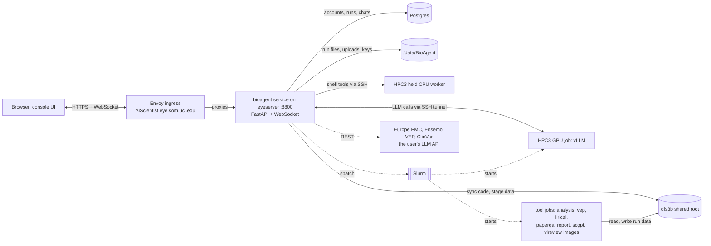
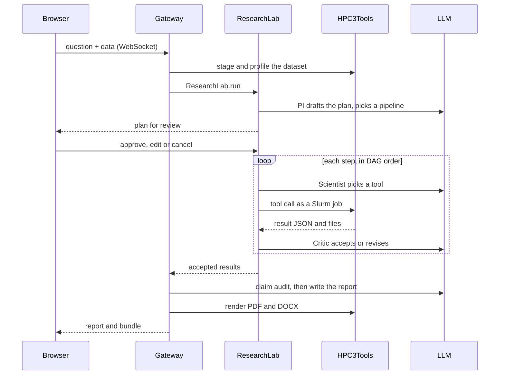
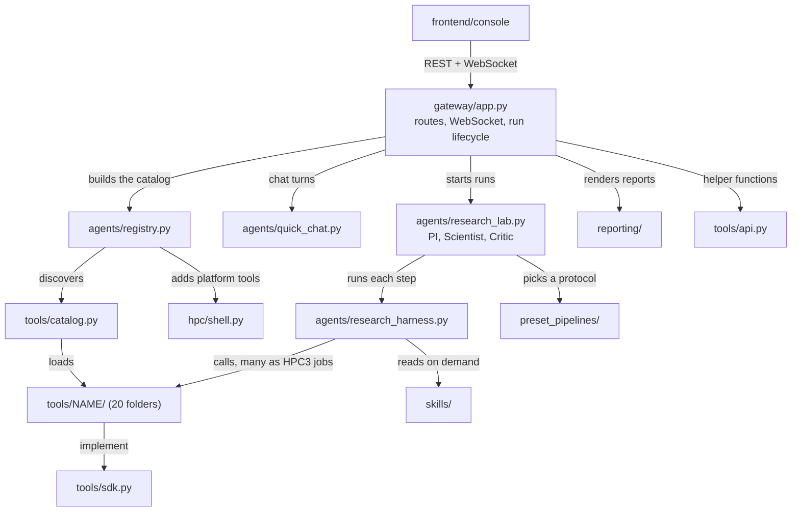
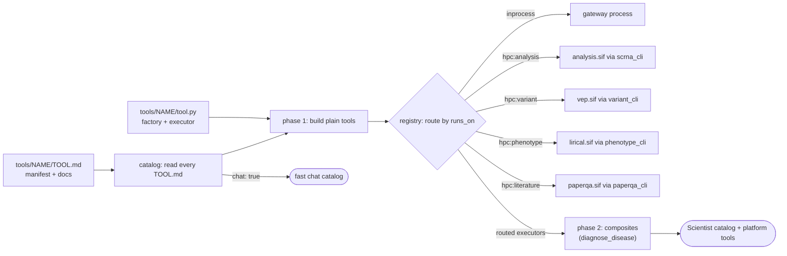

# AiScientist architecture

For whoever picks the project up: where it runs, how one research run flows, how the code is
layered, and how the tools are found and routed. The split into three repositories is in
[REPO_SPLIT.md](REPO_SPLIT.md). 中文版: [README.zh-CN.md](README.zh-CN.md).

The same diagrams, editable, are on the FigJam board
[AiScientist architecture](https://www.figma.com/board/OHeckC4jS6Yw5ET9UjBeQB) (AiScientist team).
Every model-callable tool is documented in its own folder; the index is
[src/bioagent/tools/README.md](../../src/bioagent/tools/README.md).

## The system in one paragraph

AiScientist is a web research agent for biomedical data (single-cell RNA-seq, VCFs, clinical
phenotypes). A user uploads data and asks a question. LLM roles form a virtual lab: the PI drafts a
plan, the user reviews it, the Scientist runs curated tools or its own code step by step (as Slurm
jobs on UCI HPC3), the Critic reviews every step, and the run ends in a cited manuscript-style report
(PDF / DOCX). The LLM is Qwen3.8, self-hosted with vLLM on an HPC3 GPU, or the user's own API key.

The product is called AiScientist; the code namespace stays `bioagent` (package, `BIOAGENT_*`
env vars, `/data/BioAgent`, the systemd service) for deploy compatibility. See `CLAUDE.md`.

## Where it runs

The gateway orchestrates and never does the heavy compute. On each connect it syncs its own code to
`pysrc/<user>` on dfs3b; Slurm jobs bind-mount that code into purpose-built Singularity images, so a
tool change never needs an image rebuild. All gateway-to-HPC3 traffic goes over one SSH session per
user. Deploys use `scripts/sync_deploy.sh` (rsync; the server never git-pulls).

## One research run

The fast chat path (`agents/quick_chat.py`) splits off before the plan: the same LLM, only the
`chat: true` tools, a streamed answer and no run directory. Anti-fabrication layers: the Critic's
deterministic floors (`agents/step_numbers.py`), the claim audit before writing
(`agents/claim_audit.py`), closed-set grounding facts, and `verify_report_facts` after writing.

## How the code is layered

| Package | What it owns |
|---|---|
| `src/bioagent/gateway/` | The FastAPI app (`app.py`), accounts and the database, the HPC3 session (SSH, the held worker, the GPU serve job), LLM clients and bring-your-own keys, the Slurm job executors (one per image), the environment manifest |
| `src/bioagent/agents/` | The orchestrator: the research lab, a step's tool loop, the catalog assembly, the DAG planner, the fast chat path, skills loading and induction, claim audit and step checks, agent memory |
| `src/bioagent/reporting/` | Turning a finished run into deliverables: pandoc render, result bundle, reference list, the vision-model render review |
| `src/bioagent/hpc/shell.py` | The HPC3 shell session and its eight model tools (platform tools, like `run_code`) |
| `src/bioagent/tools/` | Every model-callable domain tool, one folder each, plus the contract (`sdk.py`), discovery (`catalog.py`), the public surface (`api.py`), shared code (`_lib/`), reference data and the per-image job entry points |
| `skills/`, `preset_pipelines/` | Plain files: atomic CodeAct templates the Scientist adapts, and end-to-end protocols the PI picks |
| `frontend/console/` | The web UI |

Two files are large enough to deserve a warning: `gateway/app.py` (8.4k lines) and
`agents/research_lab.py` (6.5k). Read the matching notes in `handoff/yijun/HANDOFF.md` before
changing either; many branches that look redundant fix a specific production incident.

## Tools, skills and pipelines

| | Tool | Skill | Pipeline |
|---|---|---|---|
| What it is | Fixed code called by name with JSON arguments | An adaptable code template with guidance | An end-to-end protocol with pinned settings |
| Used by | The Scientist | The Scientist, adapted and run via `run_code` | The PI, when planning |
| How it loads | `tools/catalog.py` reads every `TOOL.md` | Progressive disclosure: manifest, then SKILL.md, then reference.py | Matched by topic; SKILL.md + PROTOCOL.md enter the plan |
| How to add one | A `tools/<name>/` folder | A `skills/<name>/` folder | A `preset_pipelines/<name>/` folder |

## How a tool is discovered and routed

A tool folder is the unit: `TOOL.md` (front matter = the manifest, body = the documentation) and
`tool.py` (the factory and the executor). The registry, the HPC3 routing, the fast-chat selection,
the analysis job's dispatcher and the System page all read the manifests, so adding a tool changes
no platform file. `python scripts/tool_docs.py` regenerates each TOOL.md's generated sections
(parameters, where it runs, the model-facing description) and the tool index.

## Boundaries, enforced by tests

| Rule | Test |
|---|---|
| Tools import nothing from the platform; `sdk.py` is standard library only | `tests/test_tools_boundary.py` |
| The platform reaches the tools only through `sdk`, `catalog`, `api`, and only public names | `tests/test_repo_boundaries.py` |
| Every tool folder has a manifest that matches its code; the docs are current | `tests/test_tool_manifests.py` |
| The catalog is the manifests plus the platform tools; routing follows `runs_on` | `tests/test_registry_manifests.py` |
| Tool names the platform keys logic on, and the ones skills/pipelines name, all exist | `tests/test_tool_contract.py` |
| Skills and pipelines are well-formed | `tests/test_skills_library.py` |

## Where to start reading

1. `README.md`: product and capabilities.
2. `gateway/app.py`: `_dispatch_lab` and `_run_lab`, how one message becomes a run.
3. `agents/research_lab.py`: `ResearchLab.run`, the PI / Scientist / Critic loop.
4. `agents/research_harness.py`: `ResearchHarness`, one step's tool loop.
5. `agents/registry.py` and `tools/catalog.py`: how the catalog is assembled and routed.
6. `tools/run_de/`: a typical tool (`TOOL.md`, then `tool.py`).
7. `skills/README.md`, `preset_pipelines/README.md`.
8. `deploy/README.md`, `scripts/sync_deploy.sh`: deploys.
9. `handoff/yijun/HANDOFF.md`: latest progress and known issues.
