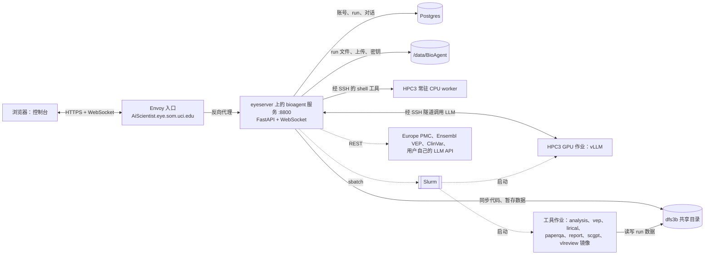
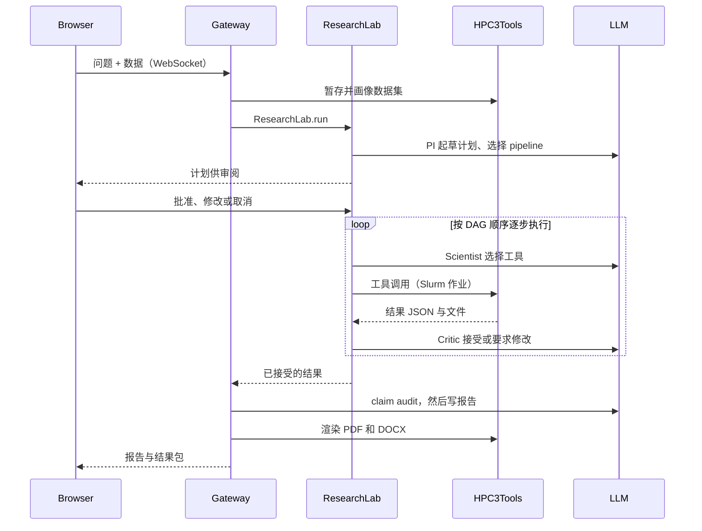
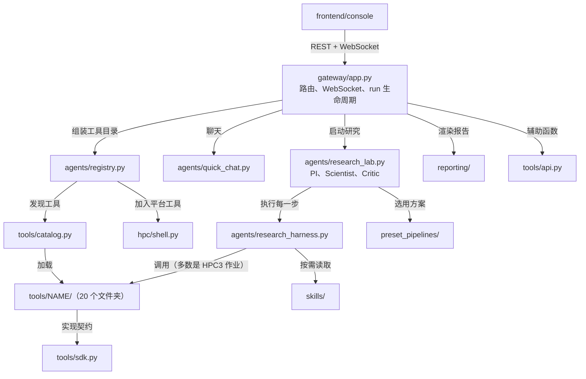
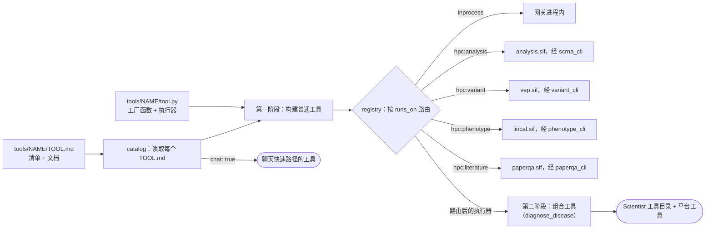

# AiScientist 架构

写给接手项目的人：系统在哪里运行、一次研究怎么跑完、代码怎么分层、工具如何被发现和路由。
拆成三个仓库的方案见 [REPO_SPLIT.zh-CN.md](REPO_SPLIT.zh-CN.md)。English: [README.md](README.md)。

同样的图（可编辑）在 FigJam 画板 [AiScientist architecture](https://www.figma.com/board/OHeckC4jS6Yw5ET9UjBeQB)
（AiScientist 团队）。每个模型可调用工具都在自己的文件夹里有说明，索引见
[src/bioagent/tools/README.md](../../src/bioagent/tools/README.md)。

## 一段话说清楚

AiScientist 是面向生物医学数据（单细胞 RNA-seq、VCF、临床表型）的网页研究智能体。用户上传数据并提问；
由 LLM 扮演的 PI、Scientist、Critic 组成虚拟实验室：PI 制定计划，用户审阅后，Scientist 逐步调用精选工具或
自己写代码（以 Slurm 作业形式在 UCI HPC3 上运行），Critic 审核每一步，最后生成带引用的论文式报告（PDF / DOCX）。
LLM 默认是 HPC3 GPU 上用 vLLM 自托管的 Qwen3.8，也可以用用户自己的 API key。

对外品牌是 AiScientist；代码命名空间仍是 `bioagent`（包名、`BIOAGENT_*` 环境变量、`/data/BioAgent`、systemd
服务名），这是有意保留的部署兼容，见 `CLAUDE.md`。

## 运行在哪里

网关只做编排、不做重计算：每次连接把自己的代码同步到 dfs3b 的 `pysrc/<user>`，Slurm 作业把这份代码 bind-mount 进
专用 Singularity 镜像，所以改工具不需要重建镜像。网关到 HPC3 的流量都走每个用户一条 SSH 会话。部署用
`scripts/sync_deploy.sh`（rsync，服务器不 git pull）。

## 一次研究运行

聊天快速路径（`agents/quick_chat.py`）在计划之前分流：同一个 LLM、只有 `chat: true` 的工具、流式回答、不建 run
目录。反编造分层：Critic 的确定性底线（`agents/step_numbers.py`）、写作前的 claim audit（`agents/claim_audit.py`）、
闭集事实约束、写完后的 `verify_report_facts`。

## 代码分层

| 包 | 负责什么 |
|---|---|
| `src/bioagent/gateway/` | FastAPI 应用（`app.py`）、账号与数据库、HPC3 会话（SSH、常驻 worker、GPU 服务作业）、LLM 客户端与自带 key、Slurm 作业执行器（每个镜像一个）、环境清单 |
| `src/bioagent/agents/` | 编排层：研究实验室、单步工具循环、工具目录组装、DAG 规划、聊天快速路径、skill 加载与归纳、claim audit 与步骤核对、agent 记忆 |
| `src/bioagent/reporting/` | 把完成的 run 变成交付物：pandoc 渲染、结果包、参考文献、视觉模型渲染审阅 |
| `src/bioagent/hpc/shell.py` | HPC3 shell 会话及其 8 个模型工具（平台工具，与 `run_code` 同类） |
| `src/bioagent/tools/` | 所有模型可调用的领域工具，一个工具一个文件夹；外加契约（`sdk.py`）、发现（`catalog.py`）、公开接口（`api.py`）、共享代码（`_lib/`）、参考数据和各镜像的作业入口 |
| `skills/`、`preset_pipelines/` | 纯文件：Scientist 改写使用的原子 CodeAct 模板，PI 选用的端到端方案 |
| `frontend/console/` | 网页界面 |

两个大文件需要预警：`gateway/app.py`（8.4k 行）和 `agents/research_lab.py`（6.5k 行）。改之前先读
`handoff/yijun/HANDOFF.md` 里对应的记录，很多看起来多余的分支都是某次线上事故的修复。

## 工具、技能、流程

| | 工具 | 技能 | 流程 |
|---|---|---|---|
| 是什么 | 固定代码，按名字 + JSON 参数调用 | 可改写的代码模板 + 使用说明 | 端到端分析方案，含钉住的参数 |
| 谁用 | Scientist | Scientist，改写后经 `run_code` 运行 | PI，制定计划时 |
| 怎么加载 | `tools/catalog.py` 读取每个 `TOOL.md` | 渐进披露：清单 → SKILL.md → reference.py | 按主题匹配，SKILL.md + PROTOCOL.md 进入计划 |
| 怎么新增 | 一个 `tools/<name>/` 文件夹 | 一个 `skills/<name>/` 文件夹 | 一个 `preset_pipelines/<name>/` 文件夹 |

## 工具如何被发现和路由

工具文件夹是基本单位：`TOOL.md`（头部 = 清单，正文 = 文档）和 `tool.py`（工厂函数和执行器）。registry、HPC3
路由、聊天工具选择、分析作业的分发器和 System 页面都读这份清单，所以新增工具不需要改平台的任何文件。
`python scripts/tool_docs.py` 会重新生成每个 TOOL.md 的生成区（参数、运行位置、模型看到的描述）和工具索引。

## 由测试守住的边界

| 规则 | 测试 |
|---|---|
| 工具不 import 平台的任何代码；`sdk.py` 只依赖标准库 | `tests/test_tools_boundary.py` |
| 平台只经 `sdk`、`catalog`、`api` 访问工具，且只用公开名字 | `tests/test_repo_boundaries.py` |
| 每个工具文件夹都有与代码一致的清单；文档是最新的 | `tests/test_tool_manifests.py` |
| 工具目录 = 清单 + 平台工具；路由遵循 `runs_on` | `tests/test_registry_manifests.py` |
| 平台逻辑依赖的工具名、skills/pipelines 提到的工具名都存在 | `tests/test_tool_contract.py` |
| skills 和 pipelines 格式正确 | `tests/test_skills_library.py` |

## 新人从哪读起

1. `README.md`：产品与能力。
2. `gateway/app.py` 的 `_dispatch_lab`、`_run_lab`：一条消息如何变成一次 run。
3. `agents/research_lab.py` 的 `ResearchLab.run`：PI / Scientist / Critic 循环。
4. `agents/research_harness.py` 的 `ResearchHarness`：单步工具循环。
5. `agents/registry.py` 和 `tools/catalog.py`：工具目录如何组装和路由。
6. `tools/run_de/`：一个典型工具（先读 `TOOL.md`，再读 `tool.py`）。
7. `skills/README.md`、`preset_pipelines/README.md`。
8. `deploy/README.md`、`scripts/sync_deploy.sh`：部署。
9. `handoff/yijun/HANDOFF.md`：最新进展与已知问题。
