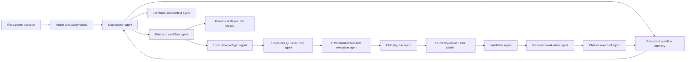

# Answer Framework

This is the full research-answering framework for the proposed local multi-agent ocular biology assistant.

The principle is simple: every answer should be backed by a recorded plan, separated execution responsibilities, an independent evaluation pass, and reusable memory.
