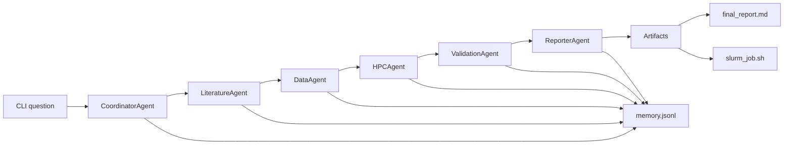

# Minimal Framework

This is the current local prototype.

```mermaid
flowchart LR
    Q["CLI question"] --> C["CoordinatorAgent"]
    C --> L["LiteratureAgent"]
    L --> D["DataAgent"]
    D --> H["HPCAgent"]
    H --> V["ValidationAgent"]
    V --> R["ReporterAgent"]
    R --> A["Artifacts"]
    A --> F["final_report.md"]
    A --> S["slurm_job.sh"]
    C --> M["memory.jsonl"]
    L --> M
    D --> M
    H --> M
    V --> M
    R --> M
```

The prototype does not execute analysis yet. It proves the orchestration skeleton, state handoff, memory logging, and Slurm boundary.
