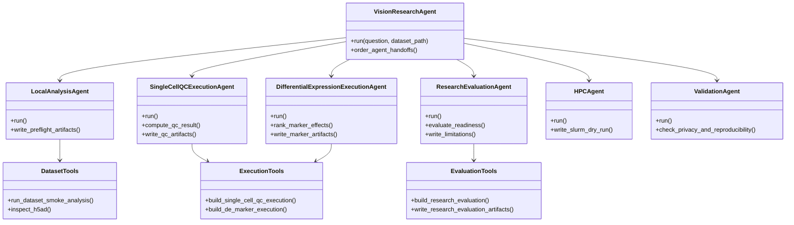

# AiScientist Project Plan

This document is the working contract for keeping the project maintainable while two people develop it.

## Product Boundary

AiScientist is a lab-specific ocular bioinformatics assistant.

It should not try to replace Kosmos. Kosmos is the broader autonomous scientist scaffold. AiScientist should become the lab-facing layer that understands vision biology workflows, validates local datasets, chooses the right analysis path, and later hands work to Kosmos tools, local scripts, or Slurm jobs.

Current product identity:

- Lab intake and workflow preflight assistant
- Local dataset triage and smoke-analysis runner
- Concrete research execution agents for QC and marker/DE screening
- Research result readiness and evidence evaluator
- OpenRouter/local-LLM planning wrapper
- Workflow memory and report generator
- Future Slurm/HPC workflow coordinator

Out of scope for the current phase:

- Real Slurm submission
- Full Scanpy or PyDESeq2 production analysis
- Raw biomedical data in LLM prompts
- Web chatbot production deployment
- Multi-agent framework migration

## UI Guidance For HPC Queue And Local Fallback

The UI should reflect the proposal's two-tier deployment model:

- Lab server: chatbot, coordinator LLM, memory, skill library, lightweight preflight, and small diagnostic fallback.
- UCI HPC3/RCIC: production high-compute CPU/GPU analysis through Slurm.

When a Slurm job is queued, the UI must not hide the queue state or silently downgrade heavy work. It should show:

- current execution mode
- queue/wait state
- last checkpoint and generated artifacts
- available actions: wait, run small local fallback, submit smaller reviewed diagnostic job, pause/resume, or request human review

Small local fallback is allowed for lightweight preflight, toy/subset diagnostics, derived-summary checks, and UI responsiveness while the HPC job waits. It is not a replacement for production HPC analysis.

Every fallback artifact, card, and final report section must carry explicit labels:

- `execution_mode=local_fallback`
- `result_scope=diagnostic_or_preflight_only`
- `not_production_hpc_result=true`

The UI copy should say: "Local fallback result generated while UCI GPU job is queued. Use for triage only; rerun on HPC for production analysis."

Production HPC artifacts should use:

- `execution_mode=hpc_slurm`
- `result_scope=production_candidate`
- visible Slurm job id/status once real submit and monitor are implemented

## Agent Boundary Decision

Do not let execution collapse into one giant agent that owns every tool.

Current rule:

- Agents decide role, boundary, and handoff.
- Tool modules do deterministic local work.
- Concrete business execution is split by scientific responsibility. The first scenario uses `SingleCellQCExecutionAgent` and `DifferentialExpressionExecutionAgent`.
- Execution tools are grouped by tool pack, such as `single_cell_qc_execution`, `de_marker_execution`, and future `pathway_enrichment_execution`.
- Evaluation stays separate from execution so the same results can be critiqued, blocked, or sent to a rerun path.

Current architecture:



## Repository Strategy

Use one monorepo now. Do not split each agent into its own repository yet.

Reasons:

- Shared state schemas are still changing.
- The same LLM provider, memory layer, CLI, harness, and dataset schema are used across agents.
- Two-person development is easier with one test suite and one review surface.
- Future repo splitting will be cleaner after the interfaces stabilize.

## Source Evolution Policy

The current harness does not autonomously edit repository source files. Future autonomous repair may modify or replace existing code, but only through a gated workflow:

- generate a proposed diff
- run tests and relevant smoke checks
- compare old/new artifacts
- record rollback information
- require human approval before applying or committing changes

Safe replacement of old versions is allowed after the gate passes. The project should not accumulate endless parallel implementations just to avoid edits.

Future split candidates:

- `bioagent-core`: state models, memory, providers, validation contracts
- `bioagent-workflows`: Scanpy, DE, pathway, spatial, multi-omics workflows
- `bioagent-hpc`: Slurm templates, job monitor, cluster deployment
- `bioagent-ui`: chatbot or dashboard
- `bioagent-kosmos-adapter`: Kosmos-specific integration package

Do not split until at least one module has a stable public interface and separate deployment needs.

## Directory Contract

```text
BioAgentPrototype.
├── configs/
│   └── aiscientist.example.env
├── docs/
│   ├── answer_framework.md
│   ├── harness_rules.md
│   ├── minimal_framework.md
│   ├── project_plan.md
│   └── repository_boundaries.md
├── examples/
│   └── datasets/
├── src/
│   └── bioagent/
│       ├── __main__.py
│       ├── core/
│       ├── agents/
│       ├── workflows/
│       ├── tools/
│       ├── hpc/
│       ├── memory/
│       ├── providers/
│       ├── integrations/
│       └── eval/
└── tests/
```

### `src/bioagent/core`

Owns shared data contracts and low-level configuration.

Allowed:

- dataclasses
- enums
- typed state objects
- `.env` loading
- schema helpers

Not allowed:

- model calls
- bioinformatics execution
- Slurm calls
- report writing

### `src/bioagent/agents`

Owns agent role implementations.

Allowed:

- coordinating state transitions
- choosing tools
- invoking provider, tool, memory, and HPC boundaries through adapters
- emitting `AgentMessage` records

Not allowed:

- raw filesystem-heavy analysis logic
- direct HTTP implementation
- direct Slurm process execution
- hardcoded secrets

### `src/bioagent/workflows`

Owns end-to-end product flows.

Allowed:

- ordering agents
- defining workflow entry points
- future LangGraph migration wrappers
- workflow-level defaults

Not allowed:

- detailed Scanpy/DE implementation
- direct provider HTTP code
- direct parsing of real dataset formats

### `src/bioagent/tools`

Owns local analysis tools that can run without LLM calls.

Allowed:

- dataset parsers
- QC smoke checks
- real Scanpy workflow scripts later
- result table generation

Not allowed:

- LLM provider calls
- user-facing orchestration
- Slurm submission

### `src/bioagent/hpc`

Owns cluster boundaries.

Allowed:

- Slurm script rendering
- future `sbatch` submission wrapper
- job status polling
- resource presets

Not allowed in current phase:

- actual `sbatch`
- real account identifiers
- destructive cluster commands

### `src/bioagent/memory`

Owns persistent workflow memory.

Allowed:

- append-only event logs
- run summaries
- provenance metadata
- future SQLite/Postgres memory backends

Not allowed:

- storing API keys
- storing raw protected dataset contents

### `src/bioagent/providers`

Owns LLM provider clients.

Allowed:

- OpenRouter client
- OpenAI-compatible local vLLM/SGLang client
- request/response normalization

Not allowed:

- agent decision logic
- dataset execution
- report formatting

### `src/bioagent/integrations`

Owns external framework adapters.

Allowed:

- Kosmos adapter
- Edison pattern adapter
- future LangGraph adapter

Not allowed:

- core agent state model definitions
- hard dependency on remote services without a fallback

### `src/bioagent/eval`

Owns harness and regression checks.

Allowed:

- pipeline logic harness
- synthetic test cases
- privacy/truthfulness gates
- future benchmark runners

Not allowed:

- real private datasets
- expensive hidden API calls

## Two-Person Development Split

Recommended split:

- Person A: `agents/`, `workflows/`, `providers/`, `memory/`
- Person B: `tools/`, `hpc/`, `integrations/`, `eval/`

Both people should review changes to:

- `core/models.py`
- `docs/archive/project_plan.md`
- `docs/repository_boundaries.md`
- any future real Slurm submission code
- any code that can touch private data

## Completed

- Monorepo structure selected.
- `.env` is ignored.
- AiScientist runtime dependencies are tracked in `requirements.txt`.
- Kosmos baseline dependency isolation is documented in `docs/dependency_management.md`.
- OpenRouter/OpenAI-compatible provider exists.
- Qwen model path works through OpenRouter.
- CLI entry point exists.
- Harness entry point exists.
- Pipeline harness passes offline.
- Pipeline harness passes with OpenRouter.
- Toy retina scRNA CSV dataset exists.
- Toy RPE spatial CSV dataset exists.
- Local dataset smoke analysis exists for CSV.
- Reports and memory artifacts are generated.
- Slurm is dry-run only.
- Figma framework diagrams were created.

## In Progress

- Clarifying the permanent module boundaries.
- Turning the current preflight agent into a professional lab tool.
- Defining future Kosmos integration points.

## Not Started

- Real `.h5ad` support.
- Real 10x matrix support.
- Real Scanpy QC workflow.
- Real differential expression workflow.
- Real pathway enrichment workflow.
- Real spatial transcriptomics workflow.
- Web chatbot UI.
- LangGraph migration.
- Slurm `sbatch` submission.
- Slurm job polling.
- UCI cluster deployment docs.
- Persistent database-backed workflow memory.
- Formal scientific validation agent.

## Current Agent Capability

The current agent is best described as:

```text
Lab Research Intake + Workflow Preflight Agent
```

It can:

- classify a request into a likely workflow
- run toy/local CSV smoke analysis
- generate a planning report
- call OpenRouter/Qwen for concise planning
- produce memory and artifact records
- create a dry-run Slurm script

It cannot yet:

- run validated scientific analysis
- handle large real lab datasets
- submit cluster jobs
- guarantee statistical correctness
- replace Kosmos research-loop capabilities

## Next Milestones

### Milestone 1: Professional Data Intake

- Add file manifest scanning.
- Add `.h5ad` metadata inspection.
- Add 10x matrix shape checks.
- Add metadata schema validation.
- Add dataset privacy filter before any LLM call.

### Milestone 2: Real QC Tooling

- Add a real Scanpy smoke workflow.
- Generate QC tables and plots.
- Distinguish failed QC from warning-level QC.
- Keep results local.

### Milestone 3: Workflow Execution Boundary

- Add command builder for local execution.
- Add execution logs.
- Add result provenance.
- Add explicit human approval before side-effect actions.

### Milestone 4: Slurm Phase

- Add Slurm templates.
- Add reviewed `sbatch` wrapper.
- Add job polling.
- Add retry/failure classification.
- Add UCI cluster setup docs.

### Milestone 5: LangGraph Phase

- Convert workflow order into nodes.
- Add checkpointing.
- Add interrupt/resume for human approvals.
- Keep current agent roles as node names.

## Definition of Done

A feature is not done unless:

- it has a test or harness case
- it has a documented boundary
- it does not leak secrets
- it does not send raw private data to the LLM
- reports distinguish planning, smoke analysis, execution, and validated results
- generated artifacts are written under `runs/` or another ignored output directory
