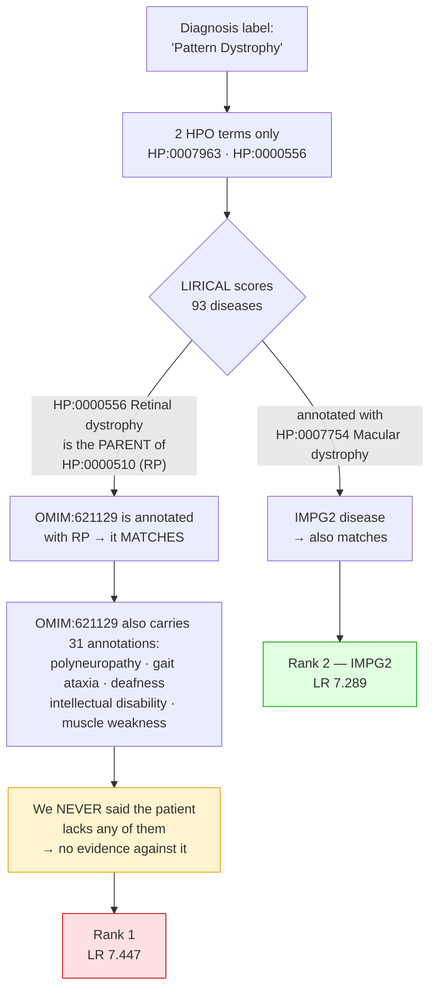
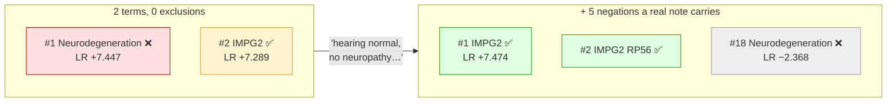
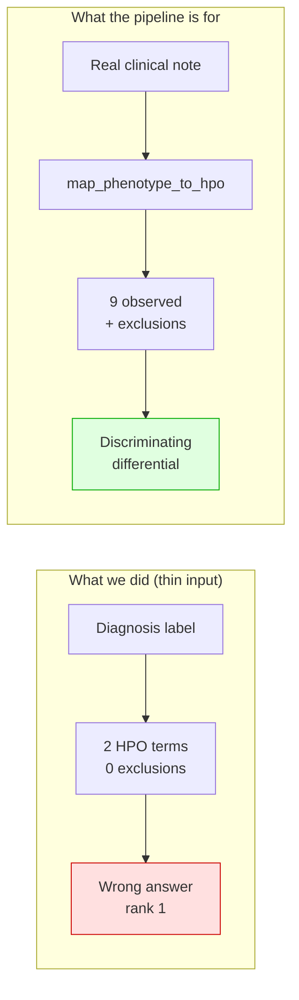

# Case CASE_A — phenotype-driven differential diagnosis

> **Provenance.** The case identifier is redacted (`CASE_A`). The gene, the disease and the two
> variants named below are public ClinVar/OMIM knowledge, and the clinical note used as input was
> *constructed* from those public annotations — it is not a patient's record. What is deliberately
> not published anywhere in this repository is which case this was.

**Answer: IMPG2, compound heterozygous** (`p.R1088*` + `p.R131C`) — the lab's known answer for this
case, recovered independently.

It first came back at **rank 2**, behind a wrong neurodegeneration syndrome. That is the interesting
part of this report, and it turned out to be **an input problem, not a tool problem**: the run was given
2 HPO terms and **zero exclusions**, because all we had was a diagnosis label. Adding five negations
that any real clinical note would carry moved the wrong answer from **rank 1 to rank 18** and put IMPG2
at rank 1 — with no change to the genome. Section 3d has the numbers.

---

## 1. What was run

| Step | Tool | Result |
|---|---|---|
| Phenotype | `map_phenotype_to_hpo` | diagnosis label `"Pattern Dystrophy"` → **2 HPO terms** |
| Differential | `run_lirical` (genotype-aware, hg19) | 4,928,515 variants scored in **4m22s**; 93 candidates |

**The phenotype input was 2 terms**, both derived from the diagnosis label alone — no clinical note was
available. Hold on to that number; it explains everything below.

## 2. The result as LIRICAL reports it

| Rank | Disease | Gene | posttest | compositeLR |
|---|---|---|---|---|
| 1 | Neurodegeneration with RP, sensorineural hearing loss, demyelinating neuropathy (OMIM:621129) | *NCBIGene:89953* | **99.9692%** | 7.447 |
| **2** | **Macular dystrophy, vitelliform, 5 (OMIM:616152)** | **IMPG2** | **99.9557%** | **7.289** |
| 3 | Retinitis pigmentosa 56 (OMIM:613581) | IMPG2 | 41.68% | 3.79 |

**IMPG2 is the known answer for this case.** It is at rank 2. A wrong disease is at rank 1.

## 3. Why rank 1 is not actually beating rank 2

### 3a. They are tied. The "99.97% vs 99.96%" is an artefact.

`compositeLR` is `log₁₀` of the likelihood ratio, and the posterior is plain Bayes from a **uniform
prior of 1/8621**:

$$\text{posttest odds} = \frac{1/8621}{1 - 1/8621} \times 10^{\text{compositeLR}}$$

That formula reproduces every number in the TSV to within rounding. Now watch what it does:

| compositeLR | actual LR | posttest |
|---|---|---|
| 4.0 | 10,000 | 53.7% |
| 5.0 | 100,000 | 92.1% |
| 6.0 | 1,000,000 | 99.1% |
| **7.289 (IMPG2)** | 19,453,601 | **99.9557%** |
| **7.447 (rank 1)** | 27,989,813 | **99.9692%** |
| 9.0 | 1,000,000,000 | 99.9991% |

**Above ~10⁶ the posterior saturates.** Every strong candidate renders as "99.9-something %". The gap
between rank 1 and rank 2 is **1.44× in a likelihood ratio of ~28 million** — statistically a coin flip,
displayed as a 0.0135-percentage-point "win".

> **The probability column has no resolution precisely where the ranking matters.** Read `compositeLR`,
> not `posttest`.

### 3b. The genotype evidence actually favours IMPG2

This is the part the ranking hides:

| | rank 1 (*NCBIGene:89953*) | **rank 2 (IMPG2)** |
|---|---|---|
| Variant 1 | `p.(H301P)` pathogenicity **0.9** | `c.3262C>T` **p.(R1088\*)** pathogenicity **1.0** |
| Variant 2 | `p.(T303P)` pathogenicity **0.8** | `c.391C>T` **p.(R131C)** pathogenicity **1.0** |
| Mechanism | two missense | **truncating + missense, compound het (AR)** |

LIRICAL found **exactly the two variants in the lab's solved-case sheet**, scored both at 1.0, and
recovered the correct compound-heterozygous mechanism. **The genotype track was right.** Rank 1 wins on
*phenotype*, not on genetics.

### 3c. So why did the phenotype favour a neurodegeneration syndrome?

Because of what we never told it.

Two mechanisms combine:

1. **Ontology ancestry.** We supplied `HP:0000556 Retinal dystrophy`, the **parent** of `HP:0000510
   Rod-cone dystrophy`. OMIM:621129 *is* annotated with rod-cone dystrophy ("…with retinitis
   pigmentosa" is in its name), so it collects credit for our vague term.
2. **Absence of exclusions.** OMIM:621129 carries 31 annotations — polyneuropathy, gait ataxia,
   sensorineural hearing loss, intellectual disability, Babinski sign, muscle weakness. A real patient
   with pattern dystrophy has **none** of these. But we passed **zero** excluded terms, so nothing
   pushed it down. Unstated ≠ absent.

**A real clinical note would have said "neurologically normal, hearing normal".** That single sentence
is what `excluded_hpo` exists to carry — and it is precisely what a diagnosis label cannot give you.

## 3d. Proof: five negations fix it

This was tested, not argued. Same VCF, same 2 observed terms — the only change was adding five
exclusions that **any real clinical note would contain** ("hearing normal, no neuropathy, no ataxia,
no intellectual disability, no weakness"):

| | compositeLR **before** | compositeLR **after** | rank |
|---|---|---|---|
| Rank-1 neurodegeneration syndrome (wrong) | **+7.447** | **−2.368** | #1 → **#18** |
| **IMPG2 — Macular dystrophy, vitelliform 5** | +7.289 | **+7.474** | #2 → **#1** |

**The wrong answer swung by 9.8 orders of magnitude** (+7.447 → −2.368 ≈ a 6-billion-fold collapse) and
left the top 4 entirely. IMPG2 took rank 1 — and *its* LR went slightly **up**, because a finding the
patient lacks that the disease also lacks is positive evidence *for* it. After the fix, IMPG2 holds
ranks **1 and 2**.

**Five words of prose were worth more than 4.9 million variants of genotype.** That is the case for the
free-text→HPO line, in one number.

## 4. What this case actually demonstrates

This is **not** a LIRICAL failure. Given 2 vague terms and no exclusions, ranking a
retinal-dystrophy-annotated syndrome first is defensible inference. **It is a starved-input failure**,
and it is the strongest argument yet for the free-text→HPO line: the discriminating information —
"hearing normal", "no neuropathy" — exists only in the clinician's prose.

## 5. Conclusions

- **IMPG2 compound heterozygous (p.R1088\* + p.R131C) is the answer.** Both variants are in the lab's
  sheet; LIRICAL independently scored both at 1.0 pathogenicity with the correct AR mechanism.
- **Rank 1 is an artefact of a starved phenotype** (2 terms, 0 exclusions), not a competing hypothesis.
  Adding five routine negations moved it from rank 1 to rank **18** (LR +7.447 → **−2.368**) and put
  IMPG2 at rank 1. Nothing about the genome changed.
- **Do not report the posterior as a confidence.** It saturates above LR 10⁶ and it moved 8× on
  near-synonym term choice in a separate experiment. **Rank genes; do not quote probabilities.**

## 6. Limitations

- One case, and the phenotype was derived from the diagnosis label itself — mildly circular.
- This is a GRCh37 case, and at the time of this run the gateway gated the whole predictor block to
  GRCh38 — so CADD/REVEL/AlphaMissense are blank here. **Fixed 2026-07-17**: predictors are now resolved
  per build, and CADD *is* staged for GRCh37 (80 GB), so a re-run would carry CADD. REVEL/AlphaMissense
  remain unstaged for GRCh37 and are skipped (never substituted with GRCh38 data).
- LIRICAL scores against curated HPO/OMIM annotations: a gene whose disease association is new **cannot**
  rank, by construction. A low rank means "not in the curated annotations", never "not causal".
- The `chr` prefix strip reported by the tool is now known to be unnecessary (LIRICAL's `svart` aliases
  `chr1`≡`1`) and harmful (it drops mitochondrial candidates). Slated for removal.
