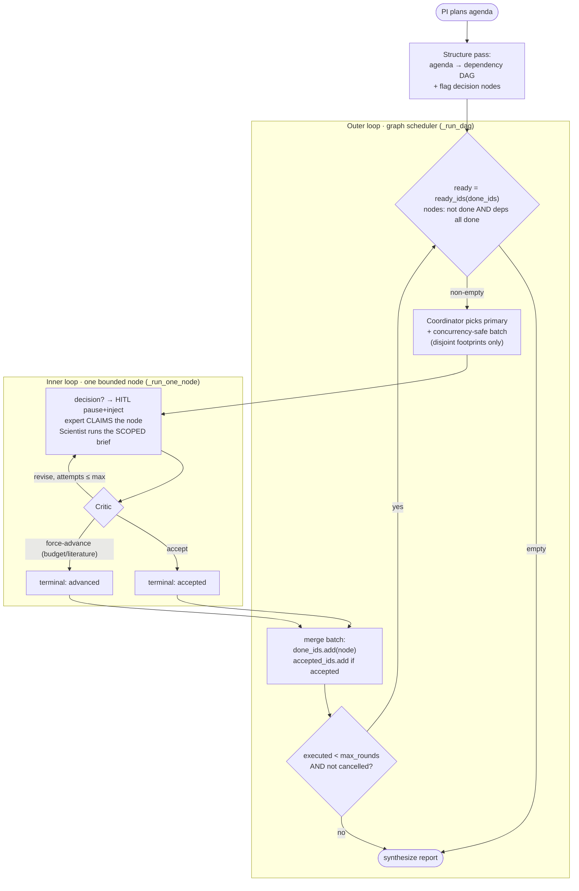
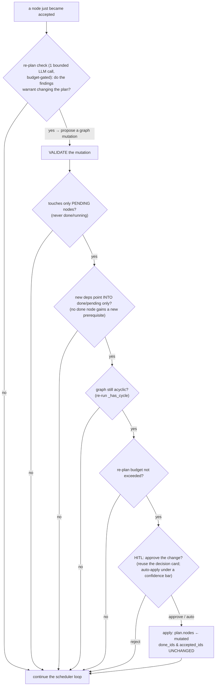

# DAG Planner + Real Multi-Agent — Design

Branch: `feat/dag-planner`. Status: **v1+v2 core LANDED on the branch** (fork A chosen; flag-gated,
`main`/prod stay linear). See §6 for what shipped vs what's next.

This doc proposes evolving the research lab from a fixed linear pipeline into a
**dependency-DAG of tasks that agents schedule themselves**, then layering **human-in-the-loop
decision points** and finally **real multi-agent** collaboration. It is grounded in the current
code, not a greenfield rewrite.

---

## 1. Where we are today (the honest baseline)

`ResearchLab._run_loop` (`src/bioagent/agents/research_lab.py`) is a **flat linear walk**:

```python
agenda: list[str]                       # e.g. ["Run QC", "Cluster", "DE by majorclass", "Enrichment", "Literature"]
while step_idx < len(agenda):
    step        = agenda[step_idx]
    specialist  = _route_specialist(step, roster)      # persona pick — cosmetic
    result      = self._scientist(...)                 # inner tool-calling loop
    verdict     = self._critic(...)                    # accept | revise
    if accept: step_idx += 1                            # else revise up to max_revisions
```

Properties (what makes it "a big pipeline"):

- **Steps are opaque strings** in a fixed order. There is **no dependency graph** — ordering is
  whatever the PI emitted, and correctness relies on the agent reading the right on-disk checkpoint
  (`work/adata_qc.h5ad` → `adata_clustered.h5ad` → `adata_de.h5ad`).
- **No scheduling freedom.** `step_idx += 1` is the only move. An agent cannot say "DE and the
  literature search don't depend on each other, do either order" or "QC is already done, skip it."
- **"Multi-agent" is persona routing.** `_route_specialist` swaps a system-prompt persona per step;
  team meetings (`_team_meeting`) are advisory (design/interpret) and never change execution.
- **The Critic is real but per-step and lenient** (accept/revise on one step's output, deterministic
  empty-guard only).

This baseline is *why* the recent bugs happened: the double-QC (a later step re-ran an upstream
stage because nothing modeled "QC is a dependency already satisfied"), and step-1-runs-everything
(no task boundaries). We patched them with prompt guards; the DAG makes them **structural**.

---

## 2. Target model

### 2.1 The plan becomes a DAG, not a list

Replace `agenda: list[str]` with a typed DAG:

```python
@dataclass(frozen=True)
class TaskNode:
    id: str                      # "qc", "cluster", "de", "enrich", "lit"
    goal: str                    # human-readable task (what the current agenda string holds)
    depends_on: tuple[str, ...]  # ids that must be ACCEPTED before this can run
    consumes: tuple[str, ...]    # checkpoints/artifacts it reads   (e.g. "adata_clustered.h5ad")
    produces: tuple[str, ...]    # checkpoints/artifacts it writes  (e.g. "adata_de.h5ad")
    suggested_tool: str | None   # steer, not force (run_de, run_enrichment, literature_search…)
    decision: bool = False       # is this a human-in-the-loop decision point? (§3)
```

The PI planner emits this graph (JSON) instead of a flat agenda. `consumes`/`produces` let the
scheduler and the Critic reason about data flow — and make "don't re-run an upstream stage whose
`produces` already exists" a **hard scheduler rule**, not a prompt plea.

### 2.2 Agents self-schedule over the DAG (no concurrency required)

`_run_loop` → `_run_dag`:

```
ready  = nodes with all depends_on ACCEPTED and not yet done
while ready is non-empty and budget remains:
    node = pick(ready)                 # §2.3 — who/what chooses
    if node.produces already exist and inputs unchanged:   # structural reuse
        mark done (reuse), continue                        # <- kills the double-QC class of bug
    result  = scientist(node)          # scoped to THIS node's goal/consumes/produces
    verdict = critic(node, result)     # can also check produces actually appeared
    if accept: mark node done; recompute ready
    else: revise / re-plan (§2.4)
```

"Self-decide scheduling" = **the set of runnable tasks is derived from the DAG, and an agent picks
among them** (or reorders / inserts), instead of a hard-coded `+= 1`. **No parallelism needed** —
`pick` returns one node at a time; the win is *correct, data-driven ordering + structural reuse +
scoped tasks*, not wall-clock.

### 2.3 Who picks the next node — three escalating options

- **v1 (deterministic):** `pick` = topological order, ties broken by planner order. Simplest;
  already fixes reuse + scoping. Effectively "the DAG schedules itself."
- **v2 (agent-scheduled):** a lightweight **Coordinator** LLM call sees the ready set + progress so
  far and picks / defers / says "we have enough, synthesize now." This is the first point the system
  stops being a fixed pipeline — the agent decides the path through the graph.
- **v3 (dynamic graph):** the Coordinator (or a node's own result) may **add/rewrite nodes** — e.g.
  after QC sees the data is pre-annotated, insert a "validate clusters vs majorclass" node and
  retarget DE to `groupby=majorclass`. The graph becomes adaptive.

### 2.4 Re-planning / self-repair

A rejected node, or a node whose Critic finds a broken upstream `produces`, can trigger a **local
re-plan** (patch the subgraph) instead of the current blunt per-step revise loop. This is where
`Kosmos`-style iterate-until-sound lives.

---

## 3. Human-in-the-loop at key decision points

`TaskNode.decision=True` nodes **pause and ask the user** before proceeding, reusing the existing
plan-review machinery (`conn.plan_event` / clarify cards / the WS `plan_clarify` message that the
frontend already renders). Natural decision points on this data:

- "Data already has `majorclass`/`celltype` — analyze by existing labels, cluster de-novo, or both?"
- "Leiden resolution 0.8 gave 29 clusters — keep, or coarsen?"
- "Which classes/contrasts to run DE on?"

Today the plan is approved **once, up front** (and that approval can time out — see the 17b run).
Decision-point HITL means approval happens **at the moment the choice is live**, with real context,
and only for choices that matter. The plumbing exists; the DAG gives it anchor points.

## 4. Real multi-agent (the end state)

With a DAG + coordinator, "real multi-agent" becomes tractable: specialist agents (single-cell
biologist, statistician, domain expert — already modeled as `Specialist`) can **claim ready nodes**,
a first-class **Critic agent** gates each `produces`, and the **Coordinator** arbitrates. Optional
concurrency (independent branches run together) is then a scheduler flag, not a rewrite. Per prior
agreement this is **last**, after v1/v2 + HITL prove out.

---

## 5. The fork that needs your call

Two ways to build §2 (see MEMORY: long-term arch is LangGraph + Postgres checkpointer + Langfuse):

- **(A) Incremental on the current framework.** Add `TaskNode`/DAG + `_run_dag` alongside the
  existing `ResearchLab`; keep the Critic, checkpoints, resume, and all gateway/WS events. Ship v1
  (deterministic DAG) fast, then v2 coordinator. **Lower risk, reuses everything, deployable in days.**
  The DAG data model is portable to LangGraph later.
- **(B) Start the LangGraph port here.** Build the DAG execution on LangGraph from the start — gets
  the Postgres checkpointer + Langfuse tracing "for free" and aligns with the long-term direction,
  but is a much larger change touching the whole run/resume/gateway stack.

**Recommendation: A first** (v1 → v2 → HITL) to de-risk the DAG model and deliver the correctness
wins now; fold into a LangGraph port (B) as a deliberate, separate migration once the model is
proven. This matches the memory sequence (cleanup → tool registry → LangGraph port) without blocking
the multi-agent value behind a full port.

---

## 6. Proposed first increment (if A)

1. `TaskNode` + `LabPlan` (DAG) types; PI planner emits the DAG (JSON) with a back-compat shim that
   lifts a flat `agenda` into a linear DAG so nothing else breaks.
2. `_run_dag` (v1 deterministic scheduler) with **structural reuse** (skip a node whose `produces`
   already exist from an accepted upstream) and **scoped scientist briefs** (a node's `goal`/
   `consumes`/`produces` bound the task — no more "step 1 runs the whole pipeline").
3. Critic checks the node's declared `produces` actually appeared.
4. Keep the existing resume/A2 semantics by mapping them onto node ids.
5. Tests: DAG parse + topo order, reuse-skip, scoped brief, decision-node pause. Behind a
   `LabConfig.planner="dag"` flag so `main` stays on the linear loop until this is proven.

Nothing here changes `main`; all of it lands on `feat/dag-planner` and merges via PR when green.

### 6.1 Shipped (v1 + v2 core)

- `src/bioagent/agents/dag.py` — `TaskNode` / `LabPlan`, `parse_dag`, `lift_agenda_to_dag`,
  `LabPlan.ready_ids`, cycle rejection. (`tests/test_dag.py`, 9 tests.)
- `ResearchLab._structure_agenda_dag` — one LLM pass turns the REVIEWED flat agenda into a DAG
  (step text unchanged); falls back to a linear DAG on any parse failure.
- `ResearchLab._coordinator_pick` — **v2**: when >1 task is ready (a real branch), an LLM Coordinator
  chooses the next task; single-ready is taken directly; falls back to plan order.
- `ResearchLab._run_dag` — ready-set scheduler: scoped node briefs (`_node_step_text` — the
  structural cure for double-QC / step-1-runs-everything), revise-in-place, literature backfill, and
  the same team-interpret + synthesize finalize as the linear loop.
- Gated on `LabConfig.planner = "dag"` (default `"linear"`). (`tests/test_research_lab.py`: branch
  scheduling, unparseable-structure fallback, default-stays-linear.)

### 6.2 Status (roadmap §1–4)

**DONE** (all flag-gated; `planner` defaults to `"linear"`, so main/prod are byte-identical until a
flag flips):

1. ✅ **DAG plan + ready-set scheduler + Coordinator** — `_structure_agenda_dag`, `_run_dag`,
   `_coordinator_pick`; scoped node briefs; all-roots→linear safety net.
2. ✅ **Gateway wiring / console toggle** — `LabRequest.planner` + `BIOAGENT_PLANNER`; the "DAG
   planner (experimental)" checkbox; `lab_plan_dag`/`coordinator_pick`/`decision_point`/`node_claim`/
   `concurrency_batch` feed lines.
3. ✅ **HITL decision points** — structure pass flags `decision:true` + `options`; `_run_dag` pauses
   via `decision_review`, reusing `conn.plan_event` + a `decision_prompt` card; choice injected into
   the node brief. Decision timeout → PROCEED (a live analysis is never discarded).
4. ✅ **Real multi-agent — expert claiming** — `_claim_specialist` (LLM decides who does what),
   `LabConfig.multi_agent` (on when `planner="dag"`).
5. ✅ **Safe concurrency** — `_node_resources`/`_concurrency_safe` + `_run_one_node` +
   ThreadPoolExecutor batches; `LabConfig.max_concurrency` / `BIOAGENT_MAX_CONCURRENCY` (default 1).

**NOT yet done:**

6. **Resume (A2) on the DAG** — resume still uses the linear loop; map `redo_indices` onto node ids.
7. **Hard boundaries — enforce `produces`/`consumes` at the executor** — today the node boundary is
   SOFT (scoped brief + harness early-stop guards + reuse-guard). A node can still *physically* write
   a checkpoint outside its declared footprint. Hardening = the executor only lets a node write its
   declared `produces` (reuses the same footprints the concurrency model already computes). See §7.
8. **Dynamic re-planning (adaptive DAG)** — the graph is structured ONCE; §8 designs how to mutate it
   from results while preserving the closed-loop invariants.
9. **Structural reuse via `produces`-exist** — skip a node whose `produces` already exist on disk
   (needs a checkpoint-exists probe through the executor).

## 7. The execution closed loop (two nested state machines)

The DAG turns implicit, prompt-only agent boundaries into an EXPLICIT graph: a node is one bounded
unit of work (`goal` + `consumes` + `produces`); the edges are the ONLY legal handoff (agents never
call each other — a node produces its outputs, terminates, and the scheduler recomputes readiness).



**Why it is a CLOSED loop that always terminates:**

- **I1 (monotone):** `done_ids` only grows. **I2 (once):** each node reaches a terminal state (accepted
  OR force-advanced) exactly once and then enters `done_ids`. **I3 (acyclic):** `parse_dag` rejects
  cycles. **I4 (progress/termination):** `ready` is recomputed from `done_ids` each turn, so the loop
  drains the graph; `executed < max_rounds` + the per-node `max_revisions` cap bound total work.
- **The node is the agent boundary.** The agent lives entirely inside `_run_one_node`; three guards
  keep it there: the **scoped brief** ("do ONLY this, reuse upstream, don't re-run"), the harness
  **early-stop guards** (repeated-error / done-after-success / `max_steps`), and the **reuse-guard**
  in `_accepted_findings_block`. The **Critic** is the gate that closes each node's sub-loop.

## 8. Dynamic re-planning (adaptive DAG) — DESIGN (not built)

Today the graph is fixed after the structure pass; the Coordinator only re-orders WITHIN it. "Change
the research direction from results" = let a bounded re-plan step MUTATE the graph. The DAG is the
substrate that makes this tractable (you mutate a data structure, not a flat script). The whole risk
is **boundary rigor** — a careless mutation would break the §7 invariants. The design pins the
mutation to the PENDING frontier only, so the invariants hold BY CONSTRUCTION:



**The frozen/mutable split (the boundary contract):**

- **Frozen = done ∪ running.** A mutation may NOT delete a frozen node, edit its `goal`/`deps`, or add
  a NEW prerequisite into it. ⇒ I1, I2 preserved (the completed/running past is immutable).
- **Mutable = pending (not started).** May be edited or removed; new nodes are added here.
- **New-edge direction:** a pending/new node may depend on ANY node (incl. a `done` one — that is the
  whole point: "given this finding, add a follow-up that consumes it"). It may NOT become a new
  prerequisite of a frozen node.
- **Acyclicity:** apply-then-`_has_cycle`; reject the mutation whole if it cycles. ⇒ I3.
- **Budget:** `max_replans` per run; new nodes still draw on the shared `max_rounds`. ⇒ I4 (bounded).
- **HITL:** surface the proposed change to the user (reuse §3's card), or auto-apply below a scope
  threshold — the human can veto scope creep.

Because the mutation is confined to the pending frontier and re-validated for acyclicity + budget, the
outer loop's monotone-`done_ids` / termination guarantees are unchanged. Implementation touch-points:
a `_replan_check(node, rounds)` after each accept in `_run_dag`, a `LabPlan.with_mutation(...)` that
returns a NEW validated plan (nodes are frozen dataclasses — never mutate in place), and reuse of the
`decision_review` hook for approval.
