# 摘要

单细胞与空间转录组分析是一条由判断构成的长链：质控阈值、聚类分辨率、差异表达检验的选择、富集库的选择、marker 的解读、结论与文献的对齐。这条链目前由领域科学家横跨多个工具手工完成，参数选择通常不留记录。

我们构建了 **AiScientist**：一个隐私优先的多智能体生物信息学研究控制台，部署于 UCI 校园网（`aiscientist.eye.som.uci.edu`）。研究者在浏览器中用自然语言提出科学问题并指定数据集，系统通过 SSH 连接 UCI HPC3，在 Slurm GPU 上以 vLLM 托管开源权重大模型，驱动一个 PI → Scientist → Critic 的角色化循环调用真实分析工具，最终输出带图、带表、可引用的 PDF/DOCX 手稿与可下载结果包。原始数据不离开校园网，全部重算力以 Singularity 容器化的 Slurm 作业形式运行于集群。

系统当前包含 39,916 行 Python（8 个子包）、1,611 条离线测试、30 余个具名工具、15 个可重写原子技能与 7 条预设流水线，覆盖条件对比差异表达、细胞类型注释、变异解读、表型驱动鉴别诊断等九类研究场景。本文以一次真实运行（15,307 细胞 × 33,696 基因，产出 12 页手稿、26 张图、80 余张表）说明产出形态。

我们另建立了一套模型可替换性评测框架，在**不改动脚手架、只替换模型**的条件下比较十种模型配置在规划、执行、写作三个阶段的表现，并据此给出角色分流的选型建议与自托管所需的 GPU 台数估算（覆盖 RTX PRO 4500/5000/6000 Blackwell、B200、B300 五类在售设备）。四项关键机制在已知答案或真实服务模型上做了独立验证。

\newpage

# 引言

## 问题

单细胞与空间分析的每一步都包含可辩护但不唯一的选择。质控阈值取 5% 还是 10% 取决于样本是细胞还是细胞核；聚类分辨率决定了下游每一个细胞类型标签；条件对比究竟应当在细胞层面做还是聚合到样本层面，取决于生物学重复的数目；测序深度在两臂之间的失衡会把技术效应伪装成生物学。这些判断分散在不同工具与不同人的习惯里，且很少被完整记录。

## 方案

AiScientist 把这条链实现为一支**受监督的**智能体团队，并遵循三条设计原则。

**隐私优先。** 模型运行在 UCI HPC3 的 GPU 上，权重与推理不出校园网。原始数据集只存在于服务端与 HPC3，网关不保留副本。`DataBoundaryGuard` 在任何模型调用之前审查提示词，拦截原始数据行与密钥。对外的文献检索经过消毒，只携带一个裸文件名与研究问题本身；深度文献检索使用会话内的本地模型端点与本地 embedding 模型，语料分块不出校园。

**重算力留在集群。** GPU 推理、代码沙箱、scanpy 分析、报告渲染、scGPT 注释与视觉复核，全部作为 Singularity 容器化的 Slurm 作业在 HPC3 上运行。文件传输走专用传输节点，与 RCIC 对登录节点的使用规范一致。

**结果可核验。** 工具如实返回状态，缺依赖时返回 `dependency_missing` 而非伪装完成。一道**确定性守卫**（代码而非提示词）约束评审角色的接受条件。报告组装完全不经模型，图表按工具产出的文件原样嵌入。

## 命名

产品名为 **AiScientist**（前身 BioAgent），所有面向用户的文字统一使用该名。代码命名空间保留 `bioagent`：Python 包 `src/bioagent/`、环境变量 `BIOAGENT_*`、生产数据目录 `/data/BioAgent`、systemd 服务与 SSH 服务账号 `bioagent`。`core.config.apply_brand_env_aliases()` 在加载 `.env` 时双向镜像 `BIOAGENT_*` 与 `AISCIENTIST_*`，两种前缀均可解析。

\newpage

# 方法

## 系统体系结构

系统分两层，靠 per-session 的 SSH 隧道与 Slurm 作业提交解耦。web 层不持有 GPU，也不持有数据集的常驻副本。

```
浏览器 --HTTPS--> Envoy Gateway (aiscientist.eye.som.uci.edu)
                        |
                        v
   第一层 · eyeserver：FastAPI + WebSocket 控制台
   （systemd 服务 bioagent，PostgreSQL）
   账号、聊天历史、上传、编排、报告组装
                        |  SSH + Duo，per-session 隧道
                        v
   第二层 · UCI HPC3（Slurm）：
   vLLM GPU 推理 · 代码沙箱 · scanpy 分析 ·
   pandoc/XeLaTeX 报告渲染 · scGPT · 视觉复核
   —— 全部 Singularity 容器化
```

代码组织如下。

| 子包 | 职责 | 文件数 | 行数 |
|---|---|---:|---:|
| `agents/` | 研究实验室（PI/Scientist/Critic）、DAG 规划器、专家记忆、工具注册表、代码沙箱、溯源 | 20 | 10,701 |
| `gateway/` | web 控制台：SSH+Duo、Slurm vLLM 拉起与隧道、账号、聊天历史、上传、报告组装、HPC3 offload | 33 | 15,383 |
| `tools/` | 真实分析（scanpy/gseapy）、文献（Europe PMC + PaperQA2）、报告（pandoc）、scGPT、视觉复核、示意图、变异、表型 | 30 | 11,990 |
| `integrations/` | `DataBoundaryGuard` 安全层 | 5 | 761 |
| `lab/` | 研究实验室支撑 | 3 | 468 |
| `providers/` | OpenAI 兼容 LLM 客户端（含回落） | 2 | 266 |
| `hpc/` | Slurm 边界 | 2 | 226 |
| `core/` | 共享配置、品牌环境变量别名 | 2 | 113 |
| **合计** | | **97** | **39,916** |

前端为 5,244 行原生 JavaScript（无框架，按请求从磁盘提供），含 Cytoscape 用于 DAG 视图、Mermaid 用于内联图。

**数据边界。** 一次运行中数据经过三道边界：

| 阶段 | 数据位置 | 边界 |
|---|---|---|
| 上传 | 浏览器 → 网关（分块）→ HPC3 用户目录 | 网关不保留副本 |
| 分析 | HPC3 计算节点，容器内读写 | 原始矩阵从不进入提示词 |
| 模型调用 | 提示词经 `DataBoundaryGuard` 审查后送入本地 vLLM | 第一道：拦截原始行与密钥 |
| 文献检索 | 仅关键词检索出校园 | 第二道：只带裸文件名与问题 |
| 深度文献 | PaperQA2 全程在 HPC3 | 第三道：语料不出校园 |
| 结果 | HPC3 → 网关 → 浏览器 | 仅派生结果 |

工具的统一契约是：接受数据集**路径**，返回**派生指标、图表文件路径或基因列表**，从不返回原始表达矩阵。

**部署形态。** 生产环境为 eyeserver 上的 systemd 单元 `bioagent.service`，绑定节点 IP 的 `:8800`，前置无 selector 的 Kubernetes Service 与 Envoy Gateway。由于每个会话的 SSH 隧道与连接状态驻留在单进程内存中，部署采用 `replicas: 1` 与 `Recreate` 策略；生产数据库为 PostgreSQL 17（SQLite 仅用于开发与 CI）；运行产物写入持久卷；会话 cookie 的签名密钥无默认值，管理员由 bcrypt 哈希播种。

## 智能体研究实验室

活跃的智能体系统是 `src/bioagent/agents/` 中的角色化循环。**三个角色共用同一套模型权重**；区分它们的是脚手架——提示词、执行契约与确定性守卫。

| 角色 | 输入 | 产出 |
|---|---|---|
| PI | 研究问题 + 数据集画像 + 工具名册 | 有序议程 |
| Scientist | 单个步骤的简报 | 工具调用序列 + 最终答案 |
| Critic | 步骤描述 + 工具产物 | `accept` / `revise` + 评分 + 具体批评 |
| Coordinator | 就绪任务集 | 下一个执行的任务（DAG 模式） |
| 专家 | 任务描述 | 按专长认领并执行（DAG 模式） |

**数据集画像**由系统在运行前确定性计算，包含每臂细胞数、每个细胞类型每臂细胞数、测序深度中位数与深度失衡标记、生物学重复判定、单细胞与单核协议推断。该画像与工具名册共同构成 PI 的规划输入。

**单步执行契约。** 每个步骤内最多 8 次工具调用，每次调用后须读取结果再继续，并以 `finish` 返回最终答案。工具结果按条截断后进入上下文，使单步提示词规模可控。

**确定性接受守卫。** 评审角色是模型，因此在其之外设置了一道不经模型的守卫：一个步骤，若其工具调用报错或返回空结果，Critic 无权 `accept`。该守卫是代码而非提示词，模型无法绕过，从而使「工具失败 → 评审通过 → 报告叙述未发生的分析」在结构上不成立。计划审阅另设四条成文规则：每个被指定的操作是否可计算；每个被承诺的产物是否真有步骤产生；步骤描述是否与其调用工具的实际行为一致；文献步骤是提问而非断言。

**报告组装不经模型。** 循环收敛后：收集被接受的发现与工具实际写出的图表；由 `_synthesize` 写出叙述文字（唯一有模型参与的写作环节）；`tools/report.py` 经 pandoc → XeLaTeX 渲染 PDF、经 pandoc 渲染 DOCX；图表按工具产出的文件原样嵌入，无模型重绘数据图的环节；参考文献由被接受的引用确定性生成；过程细节与降级记录写入独立的技术报告，最终手稿保持干净。四层防幻觉依次为：正确的数据、闭集接地、数值格式与措辞规则、图注真实性检查。报告可在不重跑分析的前提下重新生成，单个分析步骤也可单独重跑。

**计划修订采用打补丁而非重画。** 用户在 plan mode 中以自然语言给出修改意见，模型只返回 `{"step": n, "new_text": …}`，由代码施加修改；未被提及的步骤因未被重新生成而不可能改变。仅当请求无法用单步编辑表达时才回落到整体重画。

**DAG 规划、多智能体与专家记忆**（0.2.0 新增，特性开关化且纯增量）：结构化 pass 把议程转成带显式依赖的 `LabPlan`，就绪集调度器在前置完成时启动节点，每个节点获得受限简报；Coordinator 选取就绪任务，专家按专长认领；可变足迹不相交的分支可并行；每个专家持有私有的落盘记忆（`episodes.jsonl` 与蒸馏出的 `lessons.md`），在构造简报时召回、运行后反思更新，即在冻结权重上进行上下文内学习。

## 分析工具的实现

工具名册由 `agents/registry.py` 动态组装：scanpy 可用时轻量冒烟工具让位于真实分析线；注入相应 executor 后工具改为提交 HPC3 作业并保留进程内回落；未绑定 HPC 会话时文件系统工具为空而非提供会报错的工具。名册分为单细胞分析线、变异与表型线、文献线、代码与文件、元工具五类，共 30 余个具名工具，完整目录见补充材料 S2。

关键实现要点：`run_clustering` 可用自举重采样与调整兰德指数选择 Leiden 分辨率，取仍达稳定性阈值的最细值；`run_de` 输出列固定为 `group,gene,log2fc,pval,pval_adj,score`，支持按细胞类型分层的条件对比；`run_pseudobulk_de` 用 pydeseq2 的负二项 Wald 检验在样本层面聚合；`run_depth_matched_de` 将深测序臂按分位数匹配到浅臂的逐细胞 UMI 分布后重跑同一检验，并按方向做 Spearman 相关；富集与 GSEA 均为离线实现，针对本地 `.gmt` 基因集；`map_phenotype_to_hpo` 由模型抽取短语与识别否定，而由本体拥有术语 ID，模型只能从候选中选取编号，因而不可能生成不存在的 HPO 术语。

## 模型评测设计

评测的核心设计是**保持脚手架不变、只替换模型**：每个实验臂都走真实的生产代码路径（直接调用 `ResearchLab` 的方法而非重新实现），在真实数据集（`Ddx41_DEG.h5ad`，15,307 细胞）上运行，并调用真实工具。因此实验臂之间的差异归因于模型，而所有实验臂共有的表现归因于脚手架。

| 阶段 | 运行内容 | 保持不变的量 | 评价方式 |
|---|---|---|---|
| A · 计划 | `ResearchLab._pi_plan` | 系统提示词、协议指引、数据集画像、工具名册 | 14 项确定性评分表 + 2 位盲评法官 |
| B · 执行 | `_scientist` → `ResearchHarness` → `_critic`，逐步 | 同一份固定 7 步计划；工作区预置更早步骤产物；同一套人设 | 工具调用正确性、参数匹配、调用次数、收尾状态、评审接受率 + 盲评 |
| C · 写作 | `_synthesize` → `_build_report` → `_review_report` | 同一批被接受的发现与图表 | 数值格式、措辞一致性、图表嵌入、事实性 + 盲评 |

盲评法官为 `claude-opus-5` 与 `gemini-3.1-pro-preview`，对作者臂盲评。评测代码为 `experiments/plan_vs_exec_ab/run_ab.py`，分 `prep / A / B / C / judge / report` 六个阶段运行。参评的九个模型见表 3.4.1。

**评测条件。** OpenRouter 上的 Qwen3.6 为 fp8 量化，生产为 AWQ 4-bit；本地运行工具无 Slurm 排队，故墙钟时间不可比；阶段 B 的固定计划由生产模型撰写，对所有实验臂一致；阶段 A 每臂 2–3 次重复，阶段 B 6–14 次试次，阶段 C 每提示词变体 2 次，因此结果给出的是量级与排序而非精确率。第一轮中因 API 额度上限未能完成的试次已从全部统计中剔除。

## 自托管容量与 GPU 台数估算方法

为回答「托管某个候选模型需要几张什么卡」，我们使用如下估算流程。

**第一步：权重体积。** NVFP4 量化为每权重 4 bit，另加每 16 个值一个 FP8 块尺度，合计约 4.5 bit/参数，即

$$W \approx 0.56\ \text{GB} \times P_{\text{[十亿参数]}}$$

该式为上界。我们自有的两份 NVFP4 权重实际更小（304B 模型的检查点为 126–127 GB，约 0.42 GB/十亿参数），因为非专家层占比很小且部分层保留 FP8。凡有实测检查点体积者，表中使用实测值。

**第二步：服务所需的聚合显存。** 权重之外还须容纳激活、CUDA graph 捕获、MoE 路由缓冲与一个可用的 KV 池。我们用自有的两个实测点标定这一系数：

- Qwen3.6-35B-A3B（权重 20 GB）在**单张** 96 GB 卡上服务，且留出 58.8 GiB 的 KV 池；
- DeepSeek-V4-Flash-0731（权重 127 GB）在 96 GB 卡上**须 TP=4**，TP=2 实测显存不足。

由 TP=2（192 GB 聚合）不足而 TP=4（384 GB 聚合）可用，可得所需聚合显存介于 1.5× 与 3.0× 权重之间；取

$$V_{\text{需要}} \approx 1.8 \times W$$

作为工作估计，它与上述两个实测点一致（Qwen3.6：36 GB ≤ 96 GB，单卡；DSV4-Flash：229 GB，96 GB 卡需 3 张，向上取整至 TP=4）。另有两个实测部署与之相符：MiniMax-M2.7 的 FP8 权重（220 GB）与 MiniMax-M3 的 NVFP4 权重（228 GB）均在同一 384 GB 节点上以 TP=4 加载，分别相当于 1.75 倍与 1.68 倍权重体积，故 1.8 倍是安全的规划系数，偶尔会保守一档。

**第三步：设备台数。** 台数为

$$N = \lceil V_{\text{需要}} / C_{\text{单卡}} \rceil$$

再向上取整至一个合法的张量并行度。vLLM 与 SGLang 要求张量并行度整除注意力头数，实践中取 1、2、4、8、16。

**第四步：互联。** RTX PRO 系列为 PCIe 连接、不提供 NVLink，因此在同等台数下其张量并行的扩展效率低于具备 NVLink 的 HGX B200/B300 系统。台数表回答的是「能否装下」，不是「吞吐相同」。

参与估算的在售 Blackwell 设备及其单卡显存如下（厂商公布值；96 GB 一档为我们实测使用的设备）。

| 设备 | 类别 | 单卡显存 | 互联 |
|---|---|---:|---|
| RTX PRO 4500 Blackwell | 工作站 | 32 GB GDDR7 | PCIe |
| RTX PRO 5000 Blackwell | 工作站 | 48 GB GDDR7 | PCIe |
| **RTX PRO 6000 Blackwell**（工作站 / Max-Q / 服务器版） | 工作站 / 服务器 | **96 GB GDDR7** | PCIe |
| NVIDIA B200 | 数据中心（HGX） | 180 GB HBM3e | NVLink 5 |
| NVIDIA B300（Blackwell Ultra） | 数据中心（HGX） | 288 GB HBM3e | NVLink 5 |

B200 的单卡容量在不同资料中有 180 GB 与 192 GB 两种表述；本文取较保守的 180 GB。

## 机制验证的设计

除单元测试外，四项关键机制在**已知答案**或**真实服务模型**上做了独立验证，设计如下，结果见 3.6。

**计划修订保真度。** 同一模型、同一份计划、4 个修改请求 × 5 次重复，在真实 vLLM 服务的 Qwen3.6 上比较整体重画与代码打补丁两种实现。指标为目标步骤是否命中、意图是否达成、**其他步骤被改动的数量**、步数是否变化。评分器先用合成的「完美 / 附带改动 / 丢步 / 空操作」计划自检。

**深度匹配工具的已知答案验证。** 构造答案已知的合成数据：每个细胞类型 800 细胞、300 基因，`MUT` 臂每细胞深度约为 `WT` 的 2 倍。`RealBio` 类型含 30 个表达比例确实高 3 倍的基因（正确判定为「保留」），`DepthOnly` 类型两臂比例完全相同（正确判定为「不保留」）。该验证共跑过两次：2026-08-20 一次，2026-09-02 在修复基因选择、稳健性阈值位置与两个方向的处理方式之后再跑一次。第二次是当前结果，也是下文所报告的结果。

**多智能体会议的证据分配。** 同一场解读会议、同样六条发现、同样三位专家、同样的综合提示词，唯一变量为每位专家看到全部证据还是各拿一片。六条发现刻意包含一个强的逐细胞信号与一个限制其解释的设计事实。每臂 n=1，作为机制示例。

**可审计协议格式。** 为变异注释流水线编写 operon 风格的 `PROTOCOL.md`（摘要表与每步可折叠详情：做什么、为什么、agent 选择的参数、真实命令、验证清单），命令取自真实源码；以同一套规划提示词对新旧两种文档做 A/B，按 11 分制确定性评分，另加 LLM 法官与可读性评分。

\newpage

# 结果

## 已部署的能力

下表列出已建成的能力及其在生产环境中的启用状态。

| 能力 | 已建成 | 生产启用 |
|---|:---:|:---:|
| Web 控制台（账号、SSH/Duo、Slurm vLLM、隧道、GPU 隔离、中途自动恢复） | 是 | 是 |
| 线性 PI→Scientist→Critic 实验室 | 是 | 是 |
| 真实 scanpy/gseapy 分析线 | 是 | 是 |
| 代码沙箱（CodeAct） | 是 | 是 |
| 确定性 pandoc PDF/DOCX 报告，支持不重跑重生成 | 是 | 是 |
| 文献线（Europe PMC + PaperQA2） | 是 | 是 |
| 服务端聊天历史与可续传上传 | 是 | 是 |
| 表型线（HPO 映射 + LIRICAL + 鉴别诊断） | 是 | 是 |
| 专家演化记忆 | 是 | 是 |
| 用户自带 LLM API key | 是 | 是 |
| 快速 Chat 路径与内联 Mermaid | 是 | 是 |
| 计划打补丁式修订 | 是 | 是 |
| 深度匹配验证工具 | 是 | 是 |
| DAG 规划器 | 是 | 可选 |
| 真多智能体与专家认领 | 是 | 可选 |
| 安全并发 | 是 | 可选 |
| 离线 VEP 变异线 | 是 | 可选 |
| scGPT 逐细胞注释 | 是 | 可选 |
| 视觉模型复核渲染结果 | 是 | 可选 |
| LangGraph 执行外壳 | 是 | 可选 |
| 假设驱动探索 / 多周期循环 / 技能归纳 | 是 | 可选 |
| 模型评测框架 | 是 | — |

规模指标：39,916 行 Python（97 个文件、8 个子包）、1,611 条离线测试（无需集群、`.env` 或网络）、675 次提交（自 2026-06-08 起）、5,244 行前端、15 个原子技能、7 条预设流水线。

## 覆盖的研究场景

系统当前覆盖九类研究任务。

**场景一：条件对比的单细胞差异表达研究**（预设流水线 `differential_expression`）。KO 对 WT、疾病对对照、处理对未处理的 snRNA-seq / scRNA-seq 数据集。完整链路为：

| 步骤 | 工具 | 实现要点 |
|---|---|---|
| 数据画像 | `inspect_dataset` | 确定性计算每臂细胞数、每细胞类型每臂细胞数、深度中位数、重复数判定、单细胞/单核协议推断 |
| 质控 | `run_scanpy_qc` | 逐细胞指标、细胞与基因过滤、归一化、log1p、高变基因选择；写质控图与检查点 |
| 双细胞 | `run_doublet_detection` | Scrublet，在质控之后、聚类之前 |
| 批次整合 | `run_integration` | 对象含多样本时校正供体与批次效应 |
| 聚类 | `run_clustering` | PCA → 邻接图 → Leiden → UMAP；可用自举稳定性自动选分辨率 |
| 差异表达 | `run_de` | Wilcoxon 秩和检验；给定对照层级做条件对比，给定细胞类型列在每类内分别做 |
| 聚合检验 | `run_pseudobulk_de` | 聚合到每样本一条谱，pydeseq2 负二项 Wald 检验 |
| 深度校正 | `run_depth_matched_de` | 分位数匹配 UMI 深度后重跑同一检验，按方向做 Spearman 相关 |
| 组成变化 | `run_composition` | 各细胞类型在各样本中的占比与条件间迁移 |
| 通路 | `run_enrichment` / `run_gsea_prerank` | 离线 ORA 与预排序 GSEA，按组、按方向分别进行 |
| 文献落地 | `literature_search` / `deep_literature` | 由被接受的发现构建检索式，产出带引用的结论 |
| 手稿 | 报告组装 | pandoc → XeLaTeX 的 PDF 与 DOCX，图表原样嵌入 |

**场景二：无标签数据集的细胞类型注释**（`celltype_annotation`、`scgpt_annotation`）。稳定性选分辨率把「分辨率」从未审视的假设变为有据可依的选择；`run_marker_annotation` 按 marker panel 指派细胞类型并支持谱系特异判别基因；`scgpt_annotate` 以独立的短时 GPU 批作业为每个细胞给出标签与置信度；数据集若已带标签则复用而不重算。

**场景三：遗传眼病与罕见病的变异解读**（`variant_annotation`）。生产路径为 HPC3 上的离线 VEP 加本地 cache，以容器化 Slurm 作业运行，可处理 WGS 规模 VCF；注释包含功能后果、受累基因、预测影响与 ClinVar 临床意义；致病性预测插件为 CADD、REVEL、AlphaMissense 与 OpenSpliceAI；基因组版本以 VCF 头自动检测；工具链容器内置 bcftools 1.21、samtools、tabix、bedtools 与 pysam/cyvcf2。

**场景四：表型驱动的鉴别诊断**（`phenotype_variant_diagnosis`）。`map_phenotype_to_hpo` 将任意语言的自由文本转为经校验的 HPO 术语；`run_lirical` 调用 LIRICAL 2.4.1 按校准过的验后概率排序候选疾病；`diagnose_disease` 将该概率与 PaperQA2 的文献证据结合，产出裁决过的鉴别列表。

**场景五：基因特征打分与扰动分析**（`gene_signature_scoring`、`perturbation_analysis`）。含逃逸细胞过滤、扰动对对照差异、e-distance 效应量与分层比较。

**场景六：文献落地与可引用产出。** 关键词检索式在运行时由被接受的发现构建而非由用户问题模板化生成；深度检索全程在 HPC3 上以本地模型与本地 embedding 完成；参考文献段落由被接受的引用确定性生成。

**场景七：快速问答。** Chat 路径以一份手挑的短名单工具（文献检索、HPO 映射、深度文献）提供秒级回答，入选门槛为进程内运行、秒级返回、不需运行工作区与 Slurm 作业。该名单与研究路径共用同一批工具定义，因而不会在两条路径之间漂移。

**场景八：合规的计算与数据放置。** 上传直达用户自己的 HPC3 目录，网关不留副本；传输走专用传输节点而计算与隧道留在登录节点；GPU 作业按用户隔离；per-run 过程文件集中于共享临时目录并按 3 天周期清理。

**场景九：自带模型端点。** 用户可添加自己的 OpenAI 兼容端点与密钥替换会话模型，密钥在服务端加密存储；HPC3 账号仍然必需，因为分析作业运行在集群上。

## 分析产出示例

以下取自真实运行 `c135ae589d96`（2026-09-02），数据为实验室自有的 DDX41 视网膜单核 RNA 测序数据。

| 项目 | 值 |
|---|---|
| 数据 | `Ddx41_DEG1.h5ad`，15,307 细胞 × 33,696 基因 |
| 设计 | `sampleid` 两个水平（DDX41 6,260 / WT 9,047） |
| 标签 | 文件自带 `majorclass`（11 类）与 `celltype`（87 类），复用而非重算 |
| 产出 | 12 页手稿 PDF、DOCX、技术报告、26 张图、80 余张表 |
| 渲染 | pandoc → XeLaTeX |

手稿结构为：摘要、数据集、运行内容、研究问题、结果（质控、聚类、差异表达、通路富集、深度匹配验证与 pseudobulk、组成与文献落地）、讨论、局限、结论、方法、参考文献。

其中「运行内容」一节是可复现性的核心：每个分析归属到执行它的具名工具，参数逐条列出并解释其含义，凡非默认值均标注为本轮选择。例如本轮质控的线粒体比例上限被设为 5% 而非组织常用的 10%，理由写明为数据被判定为单核（存在核比例列且线粒体中位数仅 1.5%），细胞核几乎不应携带线粒体信号。

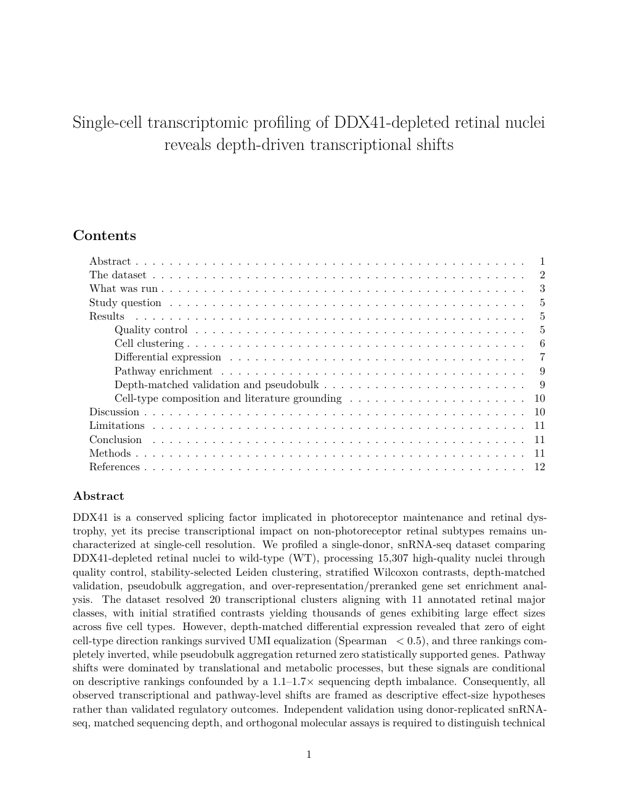{width=70%}

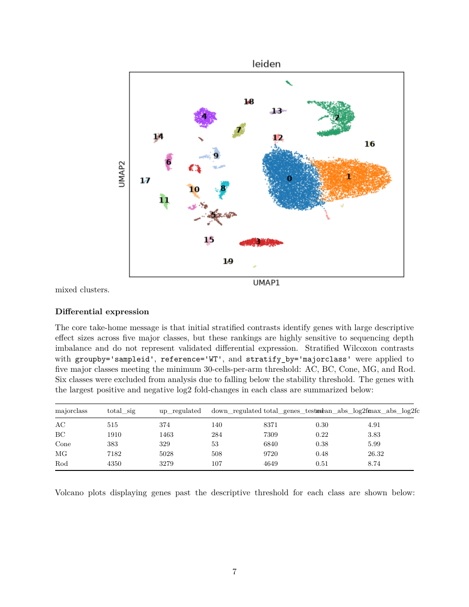{width=70%}

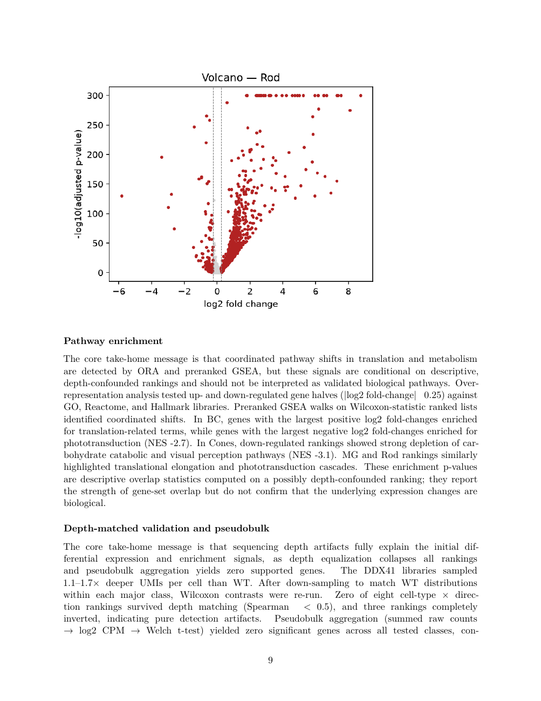{width=70%}

单次运行产出的图表均由 scanpy 与 matplotlib 确定性绘制并按原文件嵌入手稿，无模型参与作图。补充材料 S9 给出更多图例。

{width=86%}

**深度匹配验证的实际效果。** 初始分层对比在五个细胞类型中给出的效应量为：

| majorclass | 显著数 | 上调 | 下调 | 测试基因数 | 平均 abs log2FC | 最大 abs log2FC |
|---|---:|---:|---:|---:|---:|---:|
| AC | 515 | 374 | 140 | 8,371 | 0.30 | 4.91 |
| BC | 1,910 | 1,463 | 284 | 7,309 | 0.22 | 3.83 |
| Cone | 383 | 329 | 53 | 6,840 | 0.38 | 5.99 |
| MG | 7,182 | 5,028 | 508 | 9,720 | 0.48 | 26.32 |
| Rod | 4,350 | 3,279 | 107 | 4,649 | 0.51 | 8.74 |

深度匹配后的复核显示：两臂每细胞 UMI 中位数相差 1.1–1.7 倍（DDX41 3078、WT 1916）；八个「细胞类型 × 方向」排名在 UMI 均衡后均未保持（Spearman ρ < 0.5），其中三个方向反向；pseudobulk 聚合在所有被测类型上未返回统计支持的基因。系统据此将结果表述为描述性假设，并在局限一节写明需要供体重复、匹配深度与正交分子实验。这正是该能力的作用：在结论进入手稿之前，先把深度效应与生物学分离。

关于如何阅读这一判定，有一点需要说明。本次运行的报告写于 2026-09-02 18:36，而方法一节与 4.6 所述的方向修复在同日晚间才落地，因此该运行使用的是较早版本的工具——对上下两个方向使用同一个 ρ 阈值，并把两个方向都视为可检验。按当前工具，四个下调方向的排名会被报为 `against_depth_untestable` 而不计为失败，于是「八个排名均未保持」这一表述在今天应读作：四个可检验的上调排名均未保持，四个下调排名既未被验证也未被否定。上调方向的结论不变。

{width=68%}

## 模型评测结果

### 参评模型

| 实验臂 | 模型 | 说明 |
|---|---|---|
| `qwen36-35b` | qwen/qwen3.6-35b-a3b | 生产 Scientist 循环（思考关） |
| `qwen36-35b-think` | 同上 | 生产 PI / Critic / 写作者（思考开） |
| `qwen35-122b` | qwen/qwen3.5-122b-a10b | 更大的开源权重 |
| `deepseek-v4-pro` | deepseek/deepseek-v4-pro | 强开源权重 |
| `sonnet-5` | anthropic/claude-sonnet-5 | 前沿参照 |
| `gpt-5.4` | openai/gpt-5.4 | 前沿参照 |
| `minimax-m2.7` | minimax/minimax-m2.7（229B-A10B） | 自有节点候选 |
| `minimax-m3` | minimax/minimax-m3（428B-A23B，多模态） | 自有节点候选 |
| `deepseek-v4-flash` | deepseek/deepseek-v4-flash-0731（304B，MIT） | 自有节点候选 |
| `laguna-s-2.1` | poolside/laguna-s-2.1 | 前两轮之后追加；仅参与阶段 A 与 B |

### 阶段 A：计划质量

| 实验臂 | n | 步数 | 评分表 | 幻觉工具 | 深度意识 | 重复数意识 | 法官：科学性 | 具体性 | 数据契合 | 秒 |
|---|---:|---:|---:|---:|---:|---:|---:|---:|---:|---:|
| qwen36-35b | 3 | 8.33 | 0.91 | 0 | 0% | 100% | 6.00 | 6.83 | 7.50 | 24.9 |
| qwen36-35b-think | 3 | 7.67 | 0.98 | 0 | 67% | 100% | 7.17 | 7.67 | 8.17 | 285.0 |
| qwen35-122b | 3 | 9.00 | 0.94 | 0 | 33% | 100% | 6.33 | 7.33 | 8.00 | 13.2 |
| deepseek-v4-pro | 3 | 11.00 | 0.93 | 0 | 100% | 100% | 8.50 | 9.17 | 9.50 | 44.8 |
| sonnet-5 | 3 | 11.33 | 0.98 | 0 | 100% | 100% | 9.50 | 9.50 | 10.00 | 79.8 |
| gpt-5.4 | 3 | 15.67 | 0.83 | 0 | 100% | 100% | 9.33 | 9.33 | 9.67 | 29.6 |
| minimax-m2.7 | 2 | 9.00 | 1.00 | 0 | 100% | 100% | 8.50 | 8.50 | 8.75 | 53.9 |
| minimax-m3 | 2 | 11.00 | 1.00 | 0 | 100% | 100% | 9.25 | 9.50 | 9.75 | 252.4 |
| deepseek-v4-flash | 2 | 10.00 | 1.00 | 0 | 100% | 100% | 9.50 | 9.50 | 9.75 | 162.6 |
| deepseek-v4-flash-low | 2 | 8.00 | 0.97 | 0 | 100% | 100% | 9.50 | 9.50 | 9.75 | 41.8 |
| laguna-s-2.1 | 3 | 6.33 | 0.89 | 0 | 100% | 100% | 9.33 | 9.33 | 9.83 | 156.3 |

基础项（分层差异表达、组成分析、富集在差异表达之后、生物学重复警告、不虚构工具）为**所有实验臂全部达成**。区分度出现在需要判断力的项，即计划是否处理了数据集画像中标记的深度失衡，且随模型能力单调变化。

### 阶段 B：执行同一份计划

| 实验臂 | 试次 | 调用了指名工具 | 成功 | 参数匹配 | 沙箱调用/步 | 侦察/步 | 非空答案收尾 | 评审接受 |
|---|---:|---:|---:|---:|---:|---:|---:|---:|
| qwen36-35b | 14 | 86% | 86% | 1.0 | 3.36 | 3.79 | 29% | 71% |
| qwen36-35b-think | 14 | 93% | 93% | 1.0 | 3.00 | 3.79 | 36% | 93% |
| qwen35-122b | 12 | 92% | 92% | 1.0 | 1.42 | 4.92 | 17% | 92% |
| deepseek-v4-pro | 6 | 67% | 67% | 1.0 | 2.33 | 5.00 | 50% | 67% |
| minimax-m2.7 | 14 | 93% | 93% | 1.0 | 4.00 | 2.50 | 50% | 71% |
| minimax-m3 | 14 | 93% | 93% | 1.0 | 2.93 | 5.71 | 43% | 79% |
| deepseek-v4-flash | 14 | 86% | 86% | 1.0 | 4.43 | 4.86 | 21% | 79% |
| deepseek-v4-flash-low | 14 | 86% | 86% | 0.9 | 4.36 | 3.79 | 21% | 71% |
| laguna-s-2.1 | 14 | 57% | 57% | 1.0 | 2.00 | 8.79 | 14% | 29% |

除一个实验臂外，工具调用的正确性都很高：86–93% 的步骤调用了步骤指名的工具，且只要调用，参数匹配率均为 1.0（DeepSeek-V4-Flash 低推理档为 0.9）。差异集中在调用完成后的收敛行为，MiniMax-M2.7 的侦察性调用最少（2.50/步）、非空收尾率最高（50%）。代码一次跑通的比例为 MiniMax-M3 95%、DeepSeek-V4-Flash 90%、MiniMax-M2.7 86%、Qwen 79–82%。

唯一偏离这一模式的是前两轮之后追加的 `laguna-s-2.1`：它只在 57% 的步骤里调用了步骤指名的工具，每步发起 8.79 次侦察性调用（是 MiniMax-M2.7 的三倍以上），仅 14% 的步骤以非空答案收尾，评审接受率 29%，为所有实验臂最低。而它的规划能力很强——阶段 A 法官科学性 9.33、数据契合 9.83，且议程最短（6.33 步）。这正是本设计意在分离的「会规划、不会执行」的清晰个例。该实验臂未参与阶段 C。

### 阶段 C：写作同一批发现

| 实验臂 | n | 字符数 | 「significant」断言 | 提到深度 | 法官：提出假象可能 | 重复数一致 | 编造 | 质量 |
|---|---:|---:|---:|---:|---:|---:|---:|---:|
| qwen36-35b | 2 | 21,501 | 4.0 | 1 | 25% | 100% | 25% | 4.25 |
| qwen36-35b-think | 2 | 22,309 | 0.0 | 3 | 75% | 75% | 75% | 5.50 |
| qwen35-122b | 2 | 24,581 | 4.0 | 1 | 0% | 100% | 50% | 3.25 |
| deepseek-v4-pro | 2 | 28,469 | 4.0 | 2.5 | 75% | 100% | 100% | 4.75 |
| sonnet-5 | 2 | 23,818 | 2.0 | 9 | 100% | 100% | 0% | **8.50** |
| minimax-m2.7 | 2 | 41,739 | 6.5 | 9.5 | 75% | 100% | 100% | 4.50 |
| minimax-m3 | 2 | 27,967 | 3.0 | 4.5 | 100% | 100% | 50% | 7.50 |
| deepseek-v4-flash-low | 2 | 26,003 | 2.0 | 9.5 | 100% | 100% | 0% | **8.00** |

（`laguna-s-2.1` 与 `gpt-5.4` 未参与阶段 C。）

写作阶段的提示词规则（数值格式、重复数措辞、描述性差异表达、图注真实性）对所有实验臂均生效，消除了科学计数法与虚构图注一类的机械错误；判断力层面的差异由模型能力决定。另一项可操作结论是：推理型模型需要与其思考量匹配的输出预算——DeepSeek-V4-Flash 在低推理档配 6 倍输出预算下达到 8.0，为仅次于 Sonnet 5 的写作者。

## GPU 托管需求

按 2.5 的方法估算，各候选模型在五类在售 Blackwell 设备上所需的 GPU 台数如下。表内为「台数（张量并行度）」；台数已向上取整至合法的张量并行度。

| 模型 | 参数（总 / 激活） | NVFP4 权重 | 所需聚合显存 | RTX PRO 4500 32 GB | RTX PRO 5000 48 GB | **RTX PRO 6000 96 GB** | B200 180 GB | B300 288 GB |
|---|---|---:|---:|:---:|:---:|:---:|:---:|:---:|
| **Qwen3.6-35B-A3B**（生产） | 35B / 3B | 20 GB | 36 GB | 2 (TP2) | 1 | **1**〔实测〕 | 1 | 1 |
| Qwen3.5-122B-A10B | 122B / 10B | 68 GB | 123 GB | 4 (TP4) | 3 → 4 (TP4) | 2 (TP2) | 1 | 1 |
| MiniMax-M2.7 | 229B / 10B | 128 GB（FP8：220 GB〔实测〕） | 231 GB | 8 (TP8) | 5 → 8 (TP8) | **4 (TP4)**〔实测〕 | 2 (TP2) | 1 |
| MiniMax-M3 | 428B / 23B | 228 GB〔实测〕 | 384 GB〔实测〕 | 12 → 16 | 8 (TP8) | **4 (TP4)**〔实测，可加载〕 | 3 → 4 (TP4) | 2 (TP2) |
| **DeepSeek-V4-Flash-0731** | 304B / 13B | 127 GB〔实测〕 | 229 GB | 8 (TP8) | 5 → 8 (TP8) | 3 → **4 (TP4)**〔实测〕 | 2 (TP2) | 1 |
| DeepSeek-V4-Pro | 未公开 | — | — | — | — | — | — | — |
| Claude Sonnet 5 · GPT-5.4 | 闭源 | — | — | 不可自托管 | | | | |

说明：

- 〔实测〕标记的两格为我们在真实硬件上验证过的配置：Qwen3.6-35B-A3B 在单张 RTX PRO 6000 96 GB 上服务并留出 58.8 GiB KV 池；DeepSeek-V4-Flash-0731 的 NVFP4 权重在 4 张 96 GB 卡上以 TP=4 服务（SGLang 0.5.18 配 `--moe-runner-backend marlin`，512 K 上下文，约 78 tok/s），TP=2 显存不足。
- 「3 → 4」表示算术台数为 3，但张量并行度须为 2 的幂，故实际部署 4 张。
- MiniMax-M2.7 的实测部署使用**官方 FP8 权重**（磁盘 220 GB，TP=4 时每卡约 55 GB），而非 NVFP4 检查点；两种基准在 96 GB 一档都落到 4 张卡。
- MiniMax-M3 的 NVFP4 检查点实测为 **228 GB**（88/88 分片校验通过），在 4×96 GB 节点上以 TP=4 可加载，即 1.68 倍权重体积——低于 1.8 倍的规划系数，故对该模型本估算保守了一档。M3 的约束不在显存，见下方服务栈说明。
- 表中未计入多用户并发。若需同时服务多个会话，KV 池须按并发数放大；Qwen3.6 的混合注意力使其 KV 成本极低（约 20 KiB/token，见下），而常规稠密 GQA 模型的每 token 成本通常高出数倍。

**我们当前可获得的上限。** `free-gpu32` 分区对整个 `ruic20_lab` 账号提供 4 张并发 GPU，节点为每台 4 张 RTX PRO 6000 96 GB（32 CPU / 257 GB 内存），即**聚合 384 GB**。由上表，Qwen3.6-35B、Qwen3.5-122B、MiniMax-M2.7 与 DeepSeek-V4-Flash 均可在该上限内托管，MiniMax-M3 的 NVFP4 检查点同样可在该上限内以 TP=4 加载——M3 的障碍在服务栈而非显存（见下）。该分区免费但为抢占取消模式、最长 3 天；付费 `gpu` 分区不可抢占、最长 14 天，96 GB 卡按 2 倍服务单元计价。

**KV 与上下文的实测。** 生产模型 Qwen3.6-35B-A3B 为混合注意力，`layer_types` 除每第 4 层外均为线性注意力，40 层中仅 10 层持有 KV cache，约 20 KiB/token。因此 262 K 满长上下文的 KV 仅需约 5 GiB，1 GB KV 约合 5.1 万 token；`max_position_embeddings` 原生即 262,144。2026-08-02 在真实集群上的实测：

| 卡 | 分区 | KV cache | tokens | 262 K 满长并发 |
|---|---|---:|---:|---:|
| A100 80 GB PCIe（sm_80） | `gpu`（付费） | 47.8 GiB | 2,466,442 | 9.41× |
| RTX PRO 6000 Blackwell 96 GB（sm_120） | `free-gpu32`（免费） | 58.8 GiB | 3,035,461 | 11.58× |

**NVFP4 服务栈。** DeepSeek-V4-Flash 的 NVFP4 权重在 sm_120 上可用 SGLang 0.5.18 配 `--moe-runner-backend marlin` 于 TP=4 服务（512 K 上下文，约 78 tok/s，工具调用正确）；原版 vLLM 0.28.0 在 TP=4 与 131 K 上下文下亦可无补丁运行。

**MiniMax 服务栈（实测）。** MiniMax-M2.7 的官方 FP8 权重（磁盘 220 GB，TP=4 时每卡约 55 GB）在 sm_120 上可用 **vLLM 0.22.1** 配 `--tool-call-parser minimax_m2` 于 TP=4 服务，`/v1/models` 报告的上下文为 **196,608 token**，对话与工具调用均已验证。vLLM 0.27.1 与当前 nightly 会在预热前向传播中无限挂起（四张 GPU 满载 100% 持续 4 小时以上），因此版本必须钉在 0.22.1。MiniMax-M3 的 NVFP4 检查点（228 GB，88/88 分片校验通过）在同一 4×96 GB 节点上以 TP=4 可加载并起服务，但在所有稳定版 vLLM 上产生确定性的损坏输出：M3 的 NVFP4 支持位于 `vllm-project/vllm` #46380，尚未进入稳定发行版，且稳定分支是静默失败而非报错。作为对照，Llama-3.1-8B-FP4 在同一节点同一镜像上于 TP=1 与 TP=4 均输出正确，说明硬件、FP4 反量化与张量并行本身都没有问题。

## 机制验证结果

**计划修订保真度。**

| 实现 | 干净 | 有附带改动 | 平均附带改动 | 步数变化 | 意图达成 |
|---|---:|---:|---:|---:|---:|
| 整体重画（n=19） | 0% | 100% | 3.89 | 89% | 53% |
| 代码打补丁（n=19） | **100%** | 0% | 0.00 | 0% | **100%** |
| 生产实现（打补丁，n=20） | **100%** | 0% | 0.00 | 0% | **100%** |

打补丁框架不仅消除了附带改动，意图达成率也从 53% 升至 100%。该结果同时表明在计划编辑这一环节上采用更大的模型不会带来收益，生产实现据此定型。

**深度匹配工具的已知答案验证**（2026-09-02，在选择、稳健性与方向修复之后；HPC3 分析容器）。

| 细胞类型 | 方向 | Spearman ρ | 判定 |
|---|---|---:|---|
| DepthOnly | up | 0.15 | **weak** —— 正确地判为未保留 |
| DepthOnly | down | −0.05 | **against_depth_untestable** |
| RealBio | up | **0.84** | **preserved** |
| RealBio | down | 0.32 | **against_depth_untestable** |

基因层面：`RealBio` 上调方向保住 **30 个中的 27 个**真正变化的基因，背景 **0/30**；此前的判据保住 30/30，但同时放过 3/30 背景，因此现在的特异性是完美的，代价是三个真基因。`DepthOnly` 上调放过 54 个纯背景基因中的 19 个——在那里起保护作用的是排名判定 `weak`，而不是基因计数。

**两个方向中只有一个可检验，工具现在会明说。** 深度会抬高深测序臂的检出率，因此它只能在该臂制造出「上调」的假象。下调方向逆着这一梯度，低 ρ 因而不构成假象的证据；但对深测序臂做降采样又会把每个基因都推向「更下调」，所以这项检查同样无法**确认**这些基因：本次实测中，一条「效应存活」规则在 `RealBio` 下调方向上于 0.5 阈值放过 92% 的纯背景、0.8 阈值放过 73%。工具因此对该方向报 `against_depth_untestable` 并且**完全不给稳健性计数**，而不是给出一个会为噪声背书的数字。下调方向的基因在这项检查里既未被验证也未被否定。

**稳健性阈值设在 Wilcoxon z 上，0.8 是扫出来的而非选定的。** 阈值取 0.5、0.6、0.8、1.0 时，30 个真基因分别保住 30、30、27、7 个，背景始终为 0/30；而纯深度对照分别放过 50%、43%、35%、28%。

**多智能体会议的证据分配。** 共享证据时，讨论集中于一般方法论，并引用了 scVI、MAST、DESeq2 等不在证据中的方法；分片证据时，讨论锚定于本研究的证据，各方明确引用自己看过的表，形成有信息量的位置性分歧，综合环节的产出也随之从通用规则变为针对本数据集的具体判断。

**可审计协议格式。** 新格式在规划质量不降的前提下显著提升可审计性，代价约 36% 的提示词 token。据此确立的设计原则为：可读文档必须是真正运行代码的一个投影，由源码生成并加持续集成的过期检查，而非手工分叉的副本。

\newpage

# 讨论

**模型选型。** 系统已内建角色分流能力（`BIOAGENT_LAB_LLM_*`），可为不同角色配置不同模型。综合三个阶段的评测：

| 角色 | 建议模型 | 依据 |
|---|---|---|
| PI 与写作者 | DeepSeek-V4-Flash-0731 | 计划 9.5（并列最高）、写作 8.0（第二）、MIT 许可、成本最低；须配低推理档与不低于 32 k 的输出预算 |
| Scientist 循环 | MiniMax-M2.7 | 执行行为最好：侦察调用最少、非空收尾率最高；交错思考为工具调用设计；且是唯一已在自有节点上验证过服务的候选（FP8、TP=4、vLLM 0.22.1、196,608 token 上下文） |

**托管路径。** 上述两个模型在当前可获得的 4 张 RTX PRO 6000（聚合 384 GB）上均可托管，各需 4 张（TP=4）；其中 MiniMax-M2.7 是实测而非估算：其官方 FP8 权重已在 vLLM 0.22.1 下以 TP=4 起服务，上下文 196,608 token，工具调用验证通过。若两个角色需同时在线，则需 8 张卡或改用单卡容量更大的数据中心设备——B200 一档两者各需 2 张，B300 一档各需 1 张。评测数字上最均衡的 MiniMax-M3 同样能在这 384 GB 内以 TP=4 加载，因此它的障碍不是显存而是服务栈：M3 的 NVFP4 支持尚未进入稳定版 vLLM，稳定分支会静默返回损坏输出。需要注意 RTX PRO 系列为 PCIe 连接、不提供 NVLink，因此同等台数下其张量并行扩展效率低于 HGX 系统；台数表回答的是能否装下，而非吞吐相同。

**方法学。** 让实验臂走真实生产代码路径而非重新实现，是本评测设计的关键：它使「差异归因于模型、共性归因于脚手架」这一推断成立，也使评测结论可以直接转化为配置变更。同样地，用已知答案的合成数据验证 `run_depth_matched_de`，是单元测试无法替代的一步——单元测试能证明代码按设计运行，不能证明设计在科学上正确。

**适用范围。** 本文的评测在单一数据集与单一研究问题上进行，重复次数为 2–3 次，因此结论给出的是量级与排序。GPU 台数表基于厂商公布的单卡容量与一个由两个实测点标定的系数，用于容量规划而非性能预测。

\newpage

# 补充材料 {-}

## S1　操作指南 {-}

### 前置条件 {-}

| 条件 | 说明 |
|---|---|
| AiScientist 账号 | 由管理员创建；自助注册若开启，仅接受 `@uci.edu` 邮箱并需邮件验证码 |
| 网络 | UCI 校园网或 VPN |
| HPC3 账号 | 必须有；即使自带模型密钥，分析作业仍在用户自己的 HPC3 账号下运行 |
| 浏览器 | 支持 WebSocket 的现代浏览器 |

### 登录与连接 HPC3 {-}

访问 `https://aiscientist.eye.som.uci.edu/` 并输入用户名与密码。数据库只存应用密码的 bcrypt 哈希，HPC3 凭据不落库。

在 Research 页的「CONNECT TO HPC3」区域连接，三种方式：

- **密码加 Duo**：填写 UCInetID 与密码，选择 Duo 方式（推送、电话、验证码）；可勾选 Remember me 在 HPC3 上建立可复用的 SSH key，下次免密码免 Duo；勾选校园网确认后连接。
- **已保存的 SSH key**：在下拉框选择已保存的密钥，有口令则填写。私钥存放在服务端，权限 0600、按用户隔离。
- **自带模型端点**：LLM endpoint 默认为集群 GPU；可添加自己的 OpenAI 兼容端点与密钥。

连接成功后系统拉起 per-user 的 Slurm GPU 作业托管模型并在连接时预热。Mock mode 提供不连集群的演示模式。

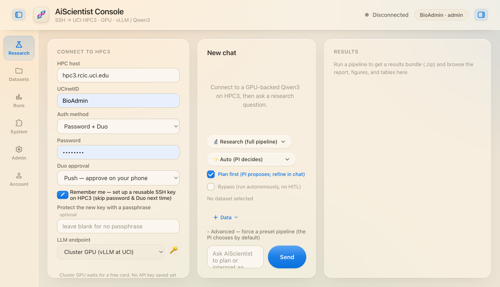{width=96%}

### 上传数据集与发起运行 {-}

上传分块且可断点续传，文件直接流入 `/dfs3b/ruic20_lab/<UCInetID>/uploads/`。一次运行可绑定多个数据文件。

| 控件 | 选项 | 含义 |
|---|---|---|
| 执行路径 | Research（完整管线） | 完整研究管线，产出手稿 |
| | Chat（快速回答） | 快速问答，秒级返回 |
| 团队形态 | Auto（PI 决定） | 由 PI 决定单或多智能体（默认） |
| | Single agent | 强制单智能体 |
| | Virtual Lab | 强制多智能体 |
| 人工闸门 | Plan first | PI 先提计划，聊天中细化后执行（默认） |
| | Bypass | 跳过人工闸门自主运行 |

Advanced 可搜索并强制指定预设流水线，默认由 PI 自选。

### Plan mode {-}

勾选 Plan first 时，PI 先产出议程并暂停。逐条阅读后在聊天里用自然语言提出修改意见，无需手工编辑文本；系统按打补丁机制施加修改。确认后开始执行，进度按角色逐 token 流式回传。

### 查看与获取结果 {-}

结果面板提供渲染后的报告、全部图、全部表，以及完整结果包下载。两个后续操作：Ask the PI to revise the report 只重写报告不重跑分析；Ask the PI to re-run an analysis step 重跑指定分析步骤。

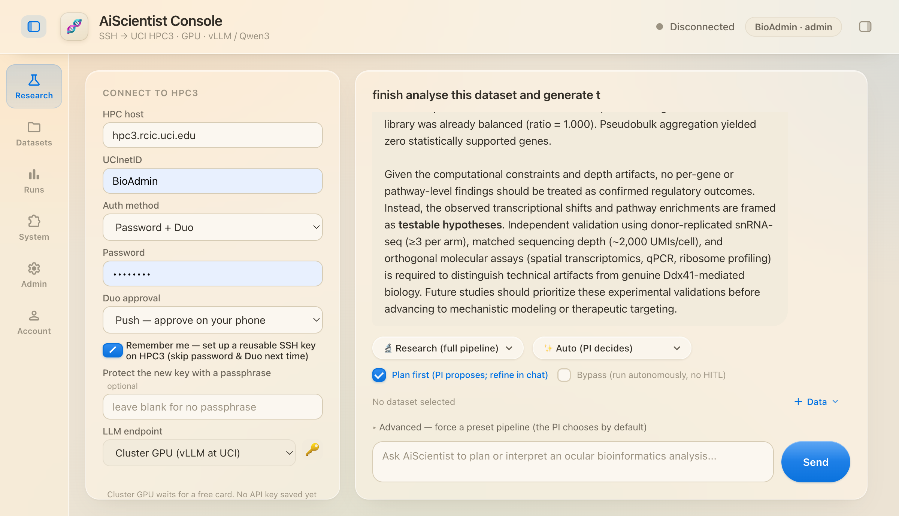{width=96%}

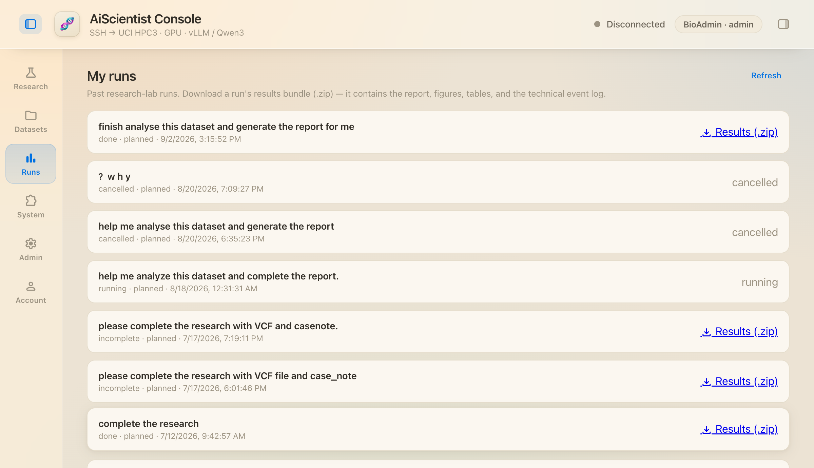{width=96%}

服务端产物路径为：

```
runs/console/<UCInetID>/<run_id>/
    figures/     图（PNG）
    tables/      表（CSV）
    report/      report.md/.pdf/.docx · technical_report.* · plan.md
    process/     run_state.json 等过程记录
    data/        检查点
```

### 管理与本地开发 {-}

命令行工具 `bioagent-admin` 提供 `create-admin`、`reset-password`、`list-users`、`hash-password`。界面中的 Admin 页提供账号管理，System 页显示工具名册与运行环境。

```bash
./deploy.sh                    # 创建 venv 并安装（幂等）
./start.sh                     # 绑定 127.0.0.1:8800
python3 -m pytest              # 1,611 条离线用例，无需集群 / .env / 网络
```

## S2　工具目录 {-}

界面的 System 页从代码实时生成该名册：每个工具列出名字、完整描述、依赖，以及在本服务器上是否可用；读私有数据的工具另有标记。

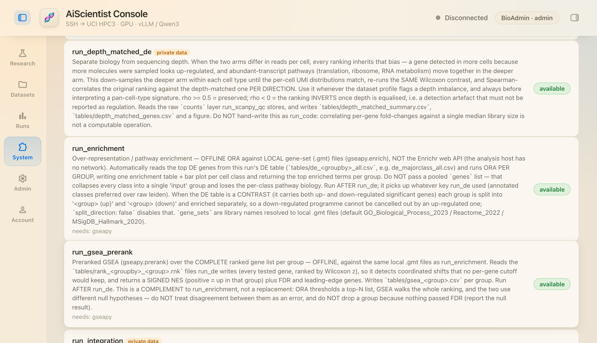{width=96%}

**单细胞分析线**

| 工具 | 作用 |
|---|---|
| `run_scanpy_qc` | 真实 scanpy 质控：逐细胞指标、细胞与基因过滤、归一化、log1p、高变基因选择 |
| `run_doublet_detection` | Scrublet 双细胞打分，质控之后、聚类之前 |
| `run_integration` | 聚类前校正样本、供体与批次效应 |
| `run_clustering` | PCA → 邻接图 → Leiden → UMAP；可用自举稳定性自动选分辨率 |
| `run_marker_annotation` | 按 marker panel 给每个簇指派细胞类型，支持谱系特异判别基因 |
| `run_de` | 差异表达（Wilcoxon）；标记模式与条件对比两种形态，支持按细胞类型分层 |
| `run_pseudobulk_de` | 聚合到每样本一条谱的条件间差异表达（pydeseq2 负二项 Wald） |
| `run_depth_matched_de` | 分位数匹配 UMI 深度后重跑同一检验，按方向做 Spearman 相关 |
| `run_composition` | 细胞类型占比与条件间迁移 |
| `run_enrichment` | 离线 ORA（本地 `.gmt`），按组、按方向分别进行 |
| `run_gsea_prerank` | 预排序 GSEA，对每组完整排序列表，离线 |
| `scgpt_annotate` | scGPT 参考式逐细胞注释（独立短时 GPU 批作业） |

**变异与表型线**

| 工具 | 作用 |
|---|---|
| `annotate_variants` | VCF 功能后果、受累基因、预测影响、ClinVar 临床意义；生产路径为 HPC3 离线 VEP 加 cache |
| `map_phenotype_to_hpo` | 自由文本（任意语言）转经校验的 HPO 术语；本体拥有 ID，模型只选编号 |
| `run_lirical` | 表型驱动鉴别诊断，按校准验后概率排序候选疾病 |
| `diagnose_disease` | LIRICAL 概率与 PaperQA2 文献证据结合的裁决式鉴别诊断 |

**文献线**

| 工具 | 作用 |
|---|---|
| `literature_search` | Europe PMC 关键词检索，取真实引用；检索式由被接受的发现构建 |
| `deep_literature` | PaperQA2 深度检索增强生成，带引用的接地答案，全程在 HPC3 |

**代码与文件**

| 工具 | 作用 |
|---|---|
| `run_code` | 代码沙箱：读取本轮数据集与检查点、写出新产物；HPC3 Slurm 作业，默认上限 64 GB / 8 CPU / 1 小时 |
| `list_dir`·`stat_path`·`find_files`·`read_text`·`disk_usage` | HPC3 文件系统只读查看 |
| `run_shell`·`install_package`·`fetch_url` | HPC3 上受控的 shell、装包与取 URL |

**元工具**

| 工具 | 作用 |
|---|---|
| `inspect_dataset` | 略读任意上传文件，返回结构化的格式、基因组版本、样本 ID 等 |
| `read_tool_source` | 读取自身分析工具的真实源码 |
| `search_skills`·`read_skill_reference` | 按关键词找原子技能，按渐进式披露读取其指引与代码 |
| `make_schematic` | 用文字描述结构，由确定性渲染器画出示意图 |
| `finish` | 结束本步并返回最终答案 |

## S3　技术栈 {-}

**第一层：Web 控制台**

| 类别 | 内容 |
|---|---|
| 运行形态 | 主机 systemd 单元 `bioagent.service`，绑定节点 IP `:8800` |
| 对外 | 无 selector 的 k8s Service → Envoy Gateway |
| 服务端 | FastAPI + WebSocket（uvicorn），Python ≥ 3.10 |
| 前端 | 原生 JS，无框架；Cytoscape（DAG 视图）、Mermaid（内联图） |
| 账号 | SQLAlchemy 2.0 + Alembic；bcrypt；itsdangerous 签名会话 cookie |
| 数据库 | 生产 PostgreSQL 17（psycopg 3）；开发与 CI 用 SQLite |
| 传输 | paramiko SSH + Duo；per-session 隧道；分块可续传上传；专用传输节点 |
| 邮件 | UCI SER SMTP（STARTTLS + AUTH） |

**第二层：HPC3 计算**

| 类别 | 内容 |
|---|---|
| 集群 | UCI HPC3，Slurm |
| 容器 | Singularity 3.11.3 |
| 推理 | vLLM，`QuantTrio/Qwen3.6-35B-A3B-AWQ`，OpenAI 兼容 `/v1`，动态端口，per-user 隔离 |
| 推理参数 | `awq_marlin` 量化；`--max-model-len` 262144；显存利用率 0.92；工具解析 `qwen3_coder`；思考解析 `qwen3` |
| GPU 请求 | 分区 `gpu`，账号 `ruic20_lab_gpu`，`--gres gpu:A100:1`，8 CPU / 32 GB / 2 小时 |
| 分析 | scanpy · anndata · leidenalg · gseapy · pydeseq2 · matplotlib |
| CPU 作业 | 分区 `standard`；沙箱上限 64 GB / 8 CPU / 1 小时 |
| 变异 | 离线 VEP 加 cache；bcftools 1.21 / samtools / tabix / bedtools；pysam / cyvcf2；CADD、REVEL、AlphaMissense、OpenSpliceAI |
| 表型 | LIRICAL 2.4.1（含 Exomiser hg19/hg38 数据） |
| 文献 | Europe PMC；PaperQA2（本地模型与本地 embedding） |
| 注释 | scGPT（独立短时 GPU 批作业） |
| 报告 | pandoc → XeLaTeX（PDF）与 DOCX；graphviz；可选视觉模型复核 |
| 存储 | `/dfs3b/ruic20_lab`；共享临时目录按 3 天清理 |

**依赖分组。** `pyproject.toml` 将依赖切分为多个 extra 使核心与 CI 保持轻量：核心仅 `h5py`；`gateway` 为 paramiko、fastapi、uvicorn；`auth` 为 sqlalchemy、bcrypt、itsdangerous、psycopg、alembic；`analysis` 为 scanpy、pydeseq2、anndata、gseapy、matplotlib、leidenalg、pandas；`literature` 为 `paper-qa[local]`；`langgraph` 为独立 extra，惰性导入，未安装时默认规划器不受影响。系统级依赖为 pandoc、texlive-xetex、graphviz。

**质量门。** 1,611 条离线测试；ruff 静态检查（`E4`、`E7`、`E9`、`F`）；GitHub Actions，main 分支四个必需检查。

## S4　术语表 {-}

| 术语 | 含义 |
|---|---|
| PI | Principal Investigator 角色，把问题拆成有序议程 |
| Scientist | 执行角色，逐步调用工具 |
| Critic | 评审角色，对每一步给出接受或修订与评分 |
| 议程 | PI 产出的有序步骤列表 |
| Plan mode | 议程执行前的人工审阅暂停 |
| run | 一次完整运行，有唯一标识，产物落在独立目录 |
| bundle | 一次运行的可下载结果包 |
| HarnessTool | 工具的统一封装（名字、描述、JSON schema、执行函数） |
| preset pipeline | 预设流水线 |
| skill | 可重写的原子技能 |
| eyeserver | 承载 web 层的实验室服务器 |
| HPC3 | UCI 研究计算集群 |

## S5　关键环境变量 {-}

代码中共有 207 个 `BIOAGENT_*` 变量，均同时接受 `AISCIENTIST_*` 前缀。

| 变量 | 默认 | 说明 |
|---|---|---|
| `BIOAGENT_HPC_HOST` | `hpc3.rcic.uci.edu` | SSH 目标 |
| `BIOAGENT_HPC_TRANSFER_HOST` | `access-hpc3.rcic.uci.edu` | 文件传输主机 |
| `BIOAGENT_SLURM_PARTITION` | `gpu` | GPU 分区 |
| `BIOAGENT_SLURM_ACCOUNT` | `ruic20_lab_gpu` | 计费账号 |
| `BIOAGENT_SLURM_GRES` | `gpu:A100:1` | GPU 请求 |
| `BIOAGENT_GPU_CANDIDATES` | 空 | 多个（分区, gres, 账号）候选竞速 |
| `BIOAGENT_LAB_STORAGE` | `/dfs3b/ruic20_lab` | 研究数据根 |
| `BIOAGENT_HPC_SHARED_ROOT` | `…/software/AiScientist` | 容器、模型缓存、临时目录 |
| `BIOAGENT_VLLM_MODEL` | `QuantTrio/Qwen3.6-35B-A3B-AWQ` | 会话模型 |
| `BIOAGENT_VLLM_MAX_MODEL_LEN` | `262144` | 上下文窗口 |
| `BIOAGENT_VLLM_QUANTIZATION` | `awq_marlin` | 空为自动判断 |
| `BIOAGENT_LAB_LLM_BASE_URL` 等 | 空 | 角色分流：PI/Critic/写作者指向另一模型 |
| `BIOAGENT_SECRET_KEY` | 无默认 | 签名会话 cookie，必须强且唯一 |
| `BIOAGENT_DATABASE_URL` | — | 生产为 `postgresql+psycopg://…` |
| `BIOAGENT_AGENT_MEMORY` | 0 | 专家演化记忆（生产已开启） |
| `BIOAGENT_PLANNER` | `linear` | 设为 `dag` 启用 DAG 规划器 |
| `BIOAGENT_MAX_CONCURRENCY` | 1 | 独立分支并行度 |

HPC3 offload 开关：`BIOAGENT_UPLOADS_ON_HPC`、`BIOAGENT_ANALYSIS_ON_HPC`、`BIOAGENT_REPORT_ON_HPC`、`BIOAGENT_RUN_CODE_ON_HPC`、`BIOAGENT_VARIANT_ON_HPC`、`BIOAGENT_PHENOTYPE_ON_HPC`、`BIOAGENT_PAPERQA_ON_HPC`。

## S6　路径约定 {-}

```
eyeserver（生产）
  /data/BioAgent/app/            应用根
  /data/BioAgent/app/.env        配置与密钥
  /data/runs/                    运行产物持久卷

HPC3
  /dfs3b/ruic20_lab/                            实验室存储根
  /dfs3b/ruic20_lab/<UCInetID>/uploads/         用户上传
  /dfs3b/ruic20_lab/software/AiScientist/       共享根
      containers/     vllm.sif · analysis.sif · report.sif · vep.sif · scgpt.sif · vlreview.sif
      hf/             HuggingFace 缓存（共享 DFS，非 $HOME）
      scgpt_model/    scGPT 权重
      Temp/           per-run 过程文件，3 天清理
```

## S7　仓库结构 {-}

```
src/bioagent/
  agents/        研究实验室、DAG 规划器、专家记忆、工具注册表、代码沙箱、溯源
  gateway/       web 控制台：SSH+Duo、Slurm vLLM、账号、聊天历史、上传、报告组装
  tools/         真实分析、文献、报告、scGPT 注释、视觉复核、示意图、变异、表型
  lab/           研究实验室支撑
  providers/     OpenAI 兼容 LLM 客户端
  integrations/  DataBoundaryGuard 安全层
  hpc/           Slurm 边界
  core/          共享配置、品牌环境变量别名

frontend/console/   浏览器 UI（按请求从磁盘提供）
deploy/             systemd 单元、k8s/Envoy、nginx、HPC3 容器定义、重部署工具
skills/             15 个可重写的原子技能
preset_pipelines/   7 条预设流水线
experiments/        5 项测量与验证
docs/               设计文档、ADR、规格、工作流
handoff/            按工作线分目录的交接文档
tests/              126 个文件，25,981 行，1,611 条用例
reports/            日期化的进展报告与本手稿
```

## S8　补充图例 {-}

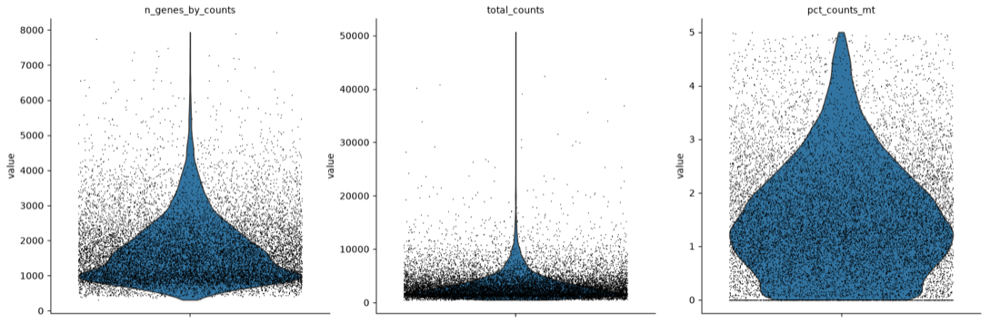{width=92%}

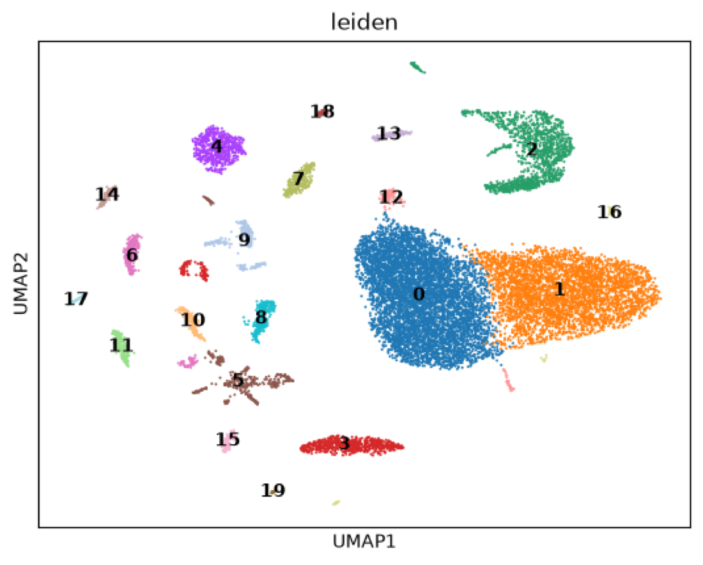{width=60%}

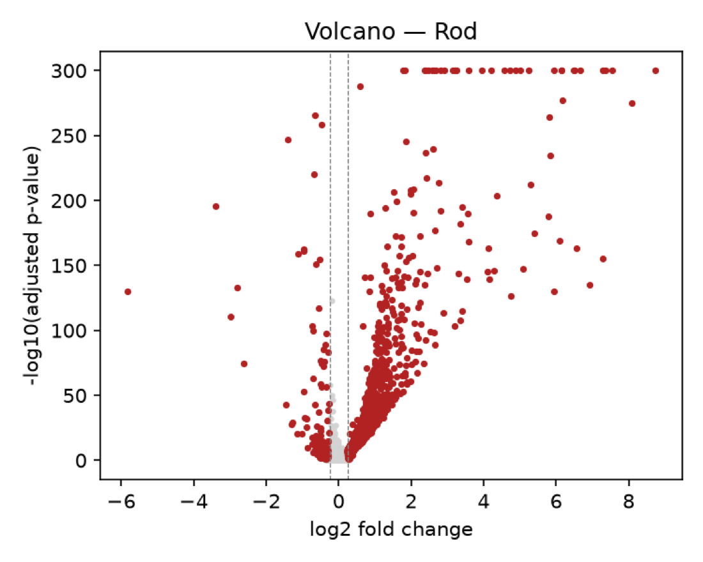{width=60%}

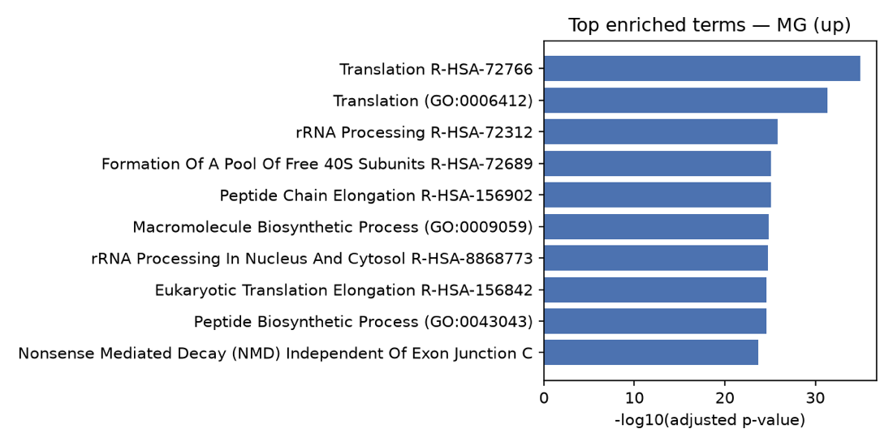{width=78%}

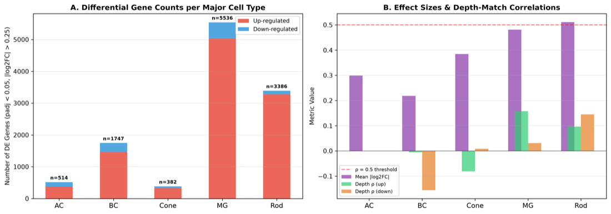{width=86%}

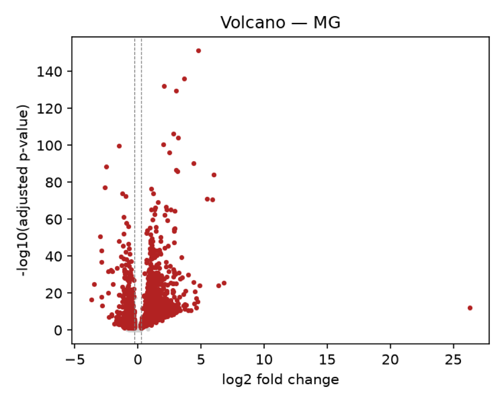{width=60%}

## S9　资料出处 {-}

| 主张 | 出处 |
|---|---|
| 源码、测试、提交计数 | 仓库统计，2026-09-05 |
| 体系结构、部署形态、依赖分组 | `README.md`、`pyproject.toml`、`deploy/README.md` |
| 角色循环、守卫、计划规则 | `src/bioagent/agents/`、`handoff/yijun/HANDOFF.md` |
| 工具描述 | 从 `src/bioagent/**/*.py` 的工具声明提取 |
| 界面截图 | 生产界面直接截取，2026-09-05 |
| 样例运行 `c135ae589d96` | 结果包 `report/`、`figures/`、`tables/` |
| 九模型评测 | `experiments/plan_vs_exec_ab/`（2026-08-19，两轮） |
| 计划修订验证 | `experiments/plan_revision_ab/` |
| 深度匹配验证 | `experiments/depth_matched_validation/`、`result-2026-09-02.log`（修复后） |
| 会议证据分配 | `experiments/meeting_asymmetry/` |
| 协议格式 A/B | `experiments/protocol_format/` |
| KV cache 与上下文实测 | `ctxprobe` 作业，2026-08-02 |
| 节点与分区特性 | `handoff/yijun/HANDOFF.md`，2026-08-10 |
| NVFP4 权重体积与服务栈 | `deploy/dsv4/` 及后续验证记录 |
| MiniMax-M2.7 / M3 服务实测 | 4×96 GB 节点上的部署试验（vLLM 0.22.1 / 0.27.1 / nightly），2026-09 记录 |
| Blackwell 设备显存 | NVIDIA 产品页与厂商公布规格（RTX PRO 6000 / 5000 / 4500：96 / 48 / 32 GB GDDR7；B200：180 GB HBM3e；B300：288 GB HBM3e） |
| 默认配置值 | `src/bioagent/gateway/settings.py` |
